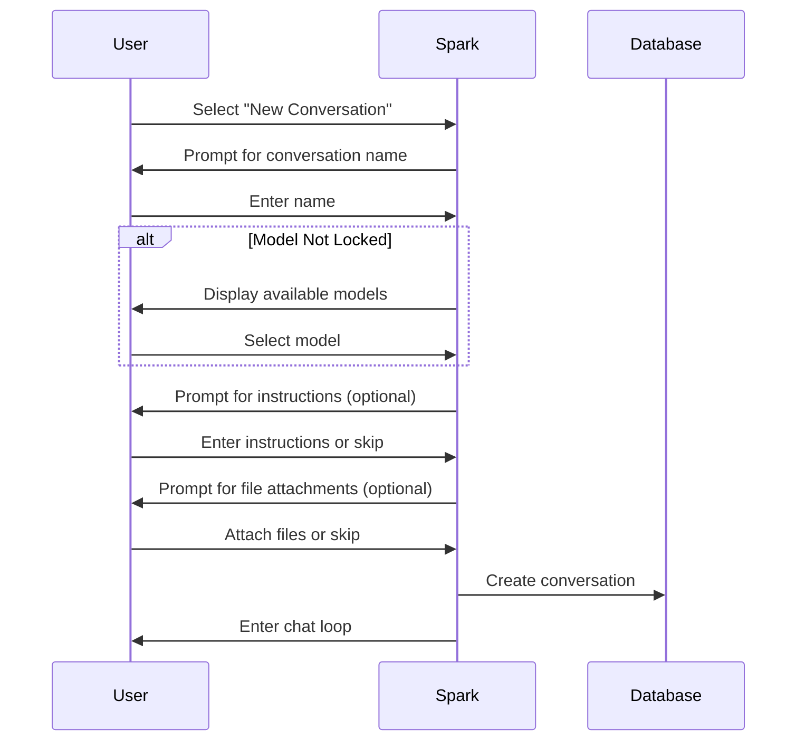

# CLI Reference

Complete reference for Spark command-line interface and chat commands.

## Command-Line Options

### Starting Spark

```bash
# Start with CLI interface (default)
spark

# Alternative command name
dtSpark
```

### Setup Wizard

```bash
spark --setup
```

Launches the interactive setup wizard to configure:
- LLM providers (AWS Bedrock, Ollama, Anthropic)
- Database backend
- Interface preferences
- Security settings

### Version Information

```bash
spark --version
```

### Help

```bash
spark --help
```

---

## Main Menu

When Spark starts, you see the main menu:

```
┏━━━━━━━━━━━━━━━━━━━━━━━━━━━━━━━━━━━━━━━━━┓
┃           SPARK - Main Menu             ┃
┣━━━━━━━━━━━━━━━━━━━━━━━━━━━━━━━━━━━━━━━━━┫
┃  1. Re-gather AWS Bedrock Costs         ┃
┃  2. Start New Conversation              ┃
┃  3. List and Select Conversation        ┃
┃  4. Manage Autonomous Actions           ┃
┃  5. Quit                                ┃
┗━━━━━━━━━━━━━━━━━━━━━━━━━━━━━━━━━━━━━━━━━┛
```

### Menu Options

| Option | Description |
|--------|-------------|
| **1** | Refresh and display AWS Bedrock usage costs |
| **2** | Create a new conversation |
| **3** | List existing conversations and select one to continue |
| **4** | Manage scheduled autonomous actions |
| **5** | Exit Spark |

---

## New Conversation Flow

When starting a new conversation:



### Step 1: Name
Enter a descriptive name for your conversation.

### Step 2: Model Selection
Choose from available models (unless model is locked in config).

### Step 3: Instructions (Optional)
Provide custom instructions for the AI assistant.

### Step 4: File Attachments (Optional)
Attach files to include in the conversation context.

---

## Autonomous Actions Menu

When selecting "Manage Autonomous Actions" from the main menu:

```
┏━━━━━━━━━━━━━━━━━━━━━━━━━━━━━━━━━━━━━━━━━━━━━━━━━━━━━━┓
┃           Autonomous Actions                          ┃
┣━━━━━━━━━━━━━━━━━━━━━━━━━━━━━━━━━━━━━━━━━━━━━━━━━━━━━━┫
┃  1. List Actions                                      ┃
┃  2. Create New Action                                 ┃
┃  3. View Action Runs                                  ┃
┃  4. Run Now                                           ┃
┃  5. Enable/Disable Action                             ┃
┃  6. Delete Action                                     ┃
┃  7. Export Run Results                                ┃
┃  8. Back to Main Menu                                 ┃
┗━━━━━━━━━━━━━━━━━━━━━━━━━━━━━━━━━━━━━━━━━━━━━━━━━━━━━━┛
```

### Submenu Options

| Option | Description |
|--------|-------------|
| **1** | Display all autonomous actions with status |
| **2** | Create a new action using the wizard |
| **3** | View execution history for an action |
| **4** | Immediately execute an action (for testing) |
| **5** | Enable or disable an action |
| **6** | Permanently delete an action |
| **7** | Export run results to file |
| **8** | Return to main menu |

### List Actions

Displays all configured autonomous actions:

```
Autonomous Actions
─────────────────────────────────────────────────────────────────────────────
ID │ Name                │ Schedule        │ Next Run           │ Status
───┼─────────────────────┼─────────────────┼────────────────────┼─────────
 1 │ Daily Cost Report   │ 0 8 * * *       │ 2025-12-16 08:00   │ Enabled
 2 │ Weekly Audit        │ 0 9 * * MON     │ 2025-12-16 09:00   │ Enabled
 3 │ Security Check      │ 2025-12-20 14:00│ 2025-12-20 14:00   │ Enabled
 4 │ Old Report          │ 0 6 * * *       │ -                  │ Disabled
─────────────────────────────────────────────────────────────────────────────
```

### Create New Action

The creation wizard walks through each step:

```
Create Autonomous Action
─────────────────────────────────────────────────────────────

Step 1: Action Name
Enter a unique name: Daily Cost Report

Step 2: Description
Enter description: Generate daily AWS cost summary report

Step 3: Action Prompt
What should the AI do?
> Analyse AWS Bedrock usage costs for the last 24 hours.
> Create a summary report highlighting the top cost drivers.
> Save the report to the reports directory.
> (Enter empty line to finish)

Step 4: Model Selection
Available Models:
  1. anthropic.claude-3-5-sonnet-20241022-v2:0
  2. anthropic.claude-3-5-haiku-20241022-v1:0
  3. meta.llama3-1-70b-instruct-v1:0
Select model [1-3]: 1

Step 5: Tool Selection
Select tools this action may use (space to toggle, enter to confirm):
  [x] get_current_datetime
  [x] list_files_recursive
  [ ] search_files
  [x] read_file_text
  [x] write_file
  [ ] create_directories

Step 6: Schedule Type
  1. One-off (run once at specific time)
  2. Recurring (run on schedule)
Select [1-2]: 2

Step 7: Schedule Configuration
Enter cron expression: 0 8 * * *
(Runs: Every day at 8:00 AM)

Step 8: Context Mode
  1. Fresh (new context each run)
  2. Cumulative (build on previous runs)
Select [1-2]: 1

Step 9: Failure Threshold
Auto-disable after how many failures? [3]: 3

─────────────────────────────────────────────────────────────
✓ Action "Daily Cost Report" created successfully
  Next run: 2025-12-16 08:00:00
```

### View Action Runs

Shows execution history for a selected action:

```
Select action:
  1. Daily Cost Report
  2. Weekly Audit
Choice: 1

Run History: Daily Cost Report
─────────────────────────────────────────────────────────────────────────
Run │ Started              │ Completed            │ Status    │ Tokens
────┼──────────────────────┼──────────────────────┼───────────┼─────────
 5  │ 2025-12-15 08:00:00  │ 2025-12-15 08:00:45  │ Completed │ 2,340
 4  │ 2025-12-14 08:00:00  │ 2025-12-14 08:00:52  │ Completed │ 2,567
 3  │ 2025-12-13 08:00:00  │ 2025-12-13 08:00:12  │ Failed    │ 890
 2  │ 2025-12-12 08:00:00  │ 2025-12-12 08:00:38  │ Completed │ 2,123
 1  │ 2025-12-11 08:00:00  │ 2025-12-11 08:00:41  │ Completed │ 2,456
─────────────────────────────────────────────────────────────────────────

View run details? Enter run number (or q to quit): 5
```

### Run Now

Immediately execute an action for testing:

```
Select action to run:
  1. Daily Cost Report
  2. Weekly Audit
Choice: 1

⏳ Executing "Daily Cost Report"...

Action Progress
─────────────────────────────────────────
Starting execution...
Preparing context (fresh mode)...
Filtering tools (4 tools selected)...
Invoking LLM...
Processing response...
Storing results...
─────────────────────────────────────────

✓ Action completed successfully in 45 seconds
  Input tokens: 1,200
  Output tokens: 1,140

View results? (y/n): y
```

### Enable/Disable Action

Toggle an action's enabled state:

```
Select action:
  1. Daily Cost Report (Enabled)
  2. Weekly Audit (Enabled)
  3. Old Report (Disabled)
Choice: 3

Action "Old Report" is currently: Disabled

Enable this action? (y/n): y
✓ Action "Old Report" enabled
  Next run: 2025-12-16 06:00:00
```

### Export Run Results

Export results to file:

```
Select action:
  1. Daily Cost Report
Choice: 1

Select run to export:
  1. Run 5 (2025-12-15 08:00 - Completed)
  2. Run 4 (2025-12-14 08:00 - Completed)
Choice: 1

Export format:
  1. Text (.txt)
  2. HTML (.html)
  3. Markdown (.md)
Choice: 3

Filename [action_run_5_2025-12-15.md]: cost_report_dec15.md

✓ Results exported to cost_report_dec15.md
```

---

## Chat Commands

During a conversation, type these commands:

### Navigation Commands

| Command | Description |
|---------|-------------|
| `exit` | Exit current conversation, return to main menu |
| `quit` | Same as exit |
| `help` | Display available commands |

### Information Commands

| Command | Description |
|---------|-------------|
| `history` | View conversation message history |
| `info` | Display conversation details (model, tokens, MCP servers) |

### Conversation Commands

| Command | Description |
|---------|-------------|
| `attach` | Attach additional files to the conversation |
| `changemodel` | Change the LLM model (if not locked) |
| `export` | Export conversation to file (MD, HTML, CSV) |
| `delete` | Delete the current conversation |

### MCP Commands

| Command | Description |
|---------|-------------|
| `mcpaudit` | View MCP tool execution audit logs |
| `mcpservers` | View and toggle MCP server states |

---

## Command Details

### history

Displays the conversation history with message roles and timestamps.

```
> history

Conversation History
─────────────────────────────────────────
[2024-12-05 10:30:15] User:
What files are in the current directory?

[2024-12-05 10:30:18] Assistant:
I'll check the directory for you...
[Tool Call: list_files_recursive]
...
```

### info

Shows detailed conversation information:

```
> info

Conversation Information
─────────────────────────────────────────
Name: Project Analysis
Model: claude-sonnet-4
Created: 2024-12-05 10:30:00
Messages: 24
Total Tokens: 15,432

Model Usage Breakdown:
  claude-sonnet-4: 12,000 tokens
  claude-3-5-haiku: 3,432 tokens

MCP Servers:
  ✓ filesystem (enabled)
  ✗ database (disabled)
```

### attach

Add files to the conversation:

```
> attach

Enter file path: ./src/main.py
✓ File attached: main.py (2,456 bytes)

Attach another file? (y/n): n
```

Supported file types:
- Text: `.txt`, `.md`, `.log`
- Code: `.py`, `.js`, `.ts`, `.java`, `.cpp`, `.c`, `.h`
- Data: `.json`, `.yaml`, `.yml`, `.xml`, `.csv`

### changemodel

Switch to a different model mid-conversation:

```
> changemodel

Available Models:
  1. claude-sonnet-4
  2. claude-3-5-sonnet-20241022
  3. claude-3-5-haiku-20241022
  4. meta.llama3-1-70b-instruct-v1:0

Select model [1-4]: 1
✓ Model changed to claude-sonnet-4
```

Note: This command is hidden if model is locked via configuration.

### export

Export conversation to various formats:

```
> export

Export Conversation
─────────────────────────────────────────
Select format:
  [1] Markdown (.md)
  [2] HTML (.html)
  [3] CSV (.csv)

Choice: 2

Include tool call details? (y/n): y

Filename [conversation_2024-12-05_103045.html]: analysis_export.html

✓ Conversation exported to analysis_export.html
```

### mcpaudit

View security audit logs for MCP tool executions:

```
> mcpaudit

MCP Transaction Audit
─────────────────────────────────────────
1. 2024-12-05 10:30:15 | filesystem | list_files_recursive
   Input: {"path": "./src"}
   Duration: 45ms
   Status: Success

2. 2024-12-05 10:30:18 | filesystem | read_file_text
   Input: {"path": "./src/main.py"}
   Duration: 12ms
   Status: Success

Options: [f]ilter, [e]xport, [q]uit:
```

Options:
- **f** - Filter by server, tool, or date range
- **e** - Export audit log to CSV
- **q** - Return to chat

### mcpservers

Manage MCP server states for the current conversation:

```
> mcpservers

MCP Server Status
─────────────────────────────────────────
1. [✓] filesystem - 6 tools
2. [✓] database - 4 tools
3. [✗] external-api - 3 tools

Toggle server (1-3) or [q]uit: 3
✓ external-api enabled

Toggle server (1-3) or [q]uit: q
```

Server states:
- **✓ Enabled** - Tools from this server available to the AI
- **✗ Disabled** - Tools from this server hidden from the AI

### delete

Delete the current conversation:

```
> delete

⚠️  Warning: This will permanently delete:
  - Conversation: "Project Analysis"
  - 24 messages
  - 3 attached files
  - All MCP transaction logs

Are you sure? (yes/no): yes
✓ Conversation deleted
```

---

## Keyboard Shortcuts

| Shortcut | Action |
|----------|--------|
| `Ctrl+C` | Cancel current operation |
| `Ctrl+D` | Exit (same as `exit` command) |
| `↑` / `↓` | Navigate input history |

---

## Token Limit Warnings

When approaching token limits, warnings display automatically:

```
⚠️  Token Warning (75%): Approaching input token limit
    Used: 75,000 / 100,000 tokens

⚠️  Token Warning (85%): High token usage
    Used: 85,000 / 100,000 tokens

⚠️  Token Warning (95%): Near token limit
    Used: 95,000 / 100,000 tokens
```

When limits are exceeded (if override enabled):

```
✗ Token limit exceeded
  Input tokens: 102,000 / 100,000

Would you like to temporarily increase the limit? (y/n): y
Enter percentage increase (e.g., 20 for 20%): 20
✓ Limit temporarily increased by 20%
```

---

## Model Response Handling

### Incomplete Responses

When a response hits the token limit:

```
⚠️  Model response may be incomplete (hit token limit).
Current max_tokens: 4,096
💡 Suggested max_tokens: 8,192

Would you like to increase max_tokens to 8,192 for this conversation? (y/n): y

✓ max_tokens increased to 8,192 for this conversation
This setting will be retained when you return to this conversation.
```

### Synthesis Warnings

When the AI creates summary documents:

```
📊 Synthesis/Summary Detected
─────────────────────────────────────────
This response aggregates data from multiple sources.
To ensure accuracy, consider asking the assistant to verify its calculations.

Suggested prompt: "Please verify the calculations in your summary"
```

---

## Context Compaction Display

When context compaction occurs:

```
─────────────────────────────────────────
🗜️  Starting intelligent context compaction...
Analysing 45 messages (128,000 tokens)...
✓ Compaction complete: 45 messages → structured context
Token reduction: 128,000 → 38,400 (70.0% reduction)
─────────────────────────────────────────
```

---

## Error Messages

### Authentication Errors

```
✗ AWS authentication failed

Would you like to authenticate now via AWS SSO? (y/n): y
[Browser opens for SSO login]
✓ Authentication successful
```

### Model Errors

```
─────────────────────────────────────────────────
✗ Failed to get response from the model
(Failed after 3 retry attempt(s))
Error Code: ThrottlingException
Error Message: Rate exceeded for model invocations
💡 Suggestion: You're hitting rate limits. Wait a moment and try again.
─────────────────────────────────────────────────
```

### Tool Permission Errors

```
🔐 Tool Permission Request
─────────────────────────────────────────
The assistant wants to use the tool: write_file

Please choose an option:
  1. Allow once - Run this time only
  2. Allow always - Run this time and all future times
  3. Deny - Don't run this time or in the future
  4. Cancel

Your choice [1/2/3/4]:
```

---

## Next Steps

- [Features Guide](features.md) - Learn about all features
- [Web Interface](web-interface.md) - Browser-based usage
- [Configuration](configuration.md) - Customise your setup
