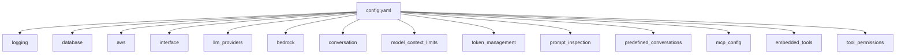
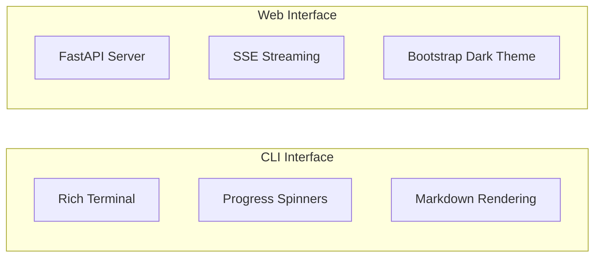
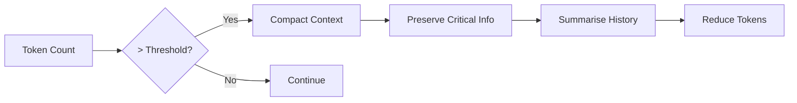

# Configuration Reference

Complete reference for all `config.yaml` settings in Spark.

## Configuration File Location

The configuration file is located at:
- **Windows**: `%APPDATA%\dtSpark\config\config.yaml`
- **macOS**: `~/Library/Application Support/dtSpark/config/config.yaml`
- **Linux**: `~/.local/share/dtSpark/config/config.yaml`

Use `spark --setup` to create the file interactively.

## Configuration Structure



---

## Logging Configuration

```yaml
logging:
  level: INFO                    # Log level: DEBUG, INFO, WARNING, ERROR, CRITICAL
  rotation_backup_count: 5       # Number of backup log files to keep
  log_to_console: false          # Also output logs to console
```

| Setting | Type | Default | Description |
|---------|------|---------|-------------|
| `level` | string | `INFO` | Minimum log level to record |
| `rotation_backup_count` | integer | `5` | Number of rotated log files to retain |
| `log_to_console` | boolean | `false` | Whether to also print logs to stdout |

---

## Database Configuration

Spark supports multiple database backends for conversation storage.

```yaml
database:
  type: sqlite  # Options: sqlite, mysql, mariadb, postgresql, mssql

  # MySQL/MariaDB configuration
  mysql:
    host: localhost
    port: 3306
    database: spark
    username: null    # null = prompt on startup
    password: null    # null = prompt on startup (recommended)
    ssl: false

  # PostgreSQL configuration
  postgresql:
    host: localhost
    port: 5432
    database: spark
    username: null
    password: null
    ssl: false

  # Microsoft SQL Server configuration
  mssql:
    host: localhost
    port: 1433
    database: spark
    username: null
    password: null
    ssl: false
    driver: "ODBC Driver 17 for SQL Server"
```

### Database Type Options

| Type | Description | Requirements |
|------|-------------|--------------|
| `sqlite` | Local file database (default) | None |
| `mysql` | MySQL server | `pip install mysql-connector-python` |
| `mariadb` | MariaDB server | `pip install mysql-connector-python` |
| `postgresql` | PostgreSQL server | `pip install psycopg2-binary` |
| `mssql` | Microsoft SQL Server | `pip install pyodbc` |

### Secure Credential Storage

Set credentials to `null` to be prompted on startup, or use the secrets manager:

```yaml
mysql:
  username: SEC/db_mysql_username  # Reference to secrets manager
  password: SEC/db_mysql_password
```

---

## AWS Configuration

```yaml
aws:
  region: us-east-1              # AWS region for Bedrock
  sso_profile: default           # AWS SSO profile name

  # Alternative: API Keys (not recommended for security)
  # access_key_id: YOUR_ACCESS_KEY
  # secret_access_key: YOUR_SECRET_KEY
  # session_token: YOUR_SESSION_TOKEN  # For temporary credentials

  cost_tracking:
    enabled: false               # Enable AWS cost tracking display
```

| Setting | Type | Default | Description |
|---------|------|---------|-------------|
| `region` | string | `us-east-1` | AWS region for Bedrock API calls |
| `sso_profile` | string | `default` | AWS SSO profile name |
| `cost_tracking.enabled` | boolean | `false` | Display AWS Bedrock costs in UI |

---

## Interface Configuration

```yaml
interface:
  type: cli  # Options: cli, web

  web:
    host: 127.0.0.1              # Bind address (localhost only for security)
    port: 0                      # 0 = random available port
    session_timeout_minutes: 30  # Session expiry time
    dark_theme: true             # Use dark theme
    auto_open_browser: true      # Open browser automatically

    ssl:
      enabled: true              # Enable HTTPS
      auto_generate_cert: true   # Auto-generate self-signed certificate
      cert_file: certs/ssl_cert.pem
      key_file: certs/ssl_key.pem
```

### Interface Types



---

## LLM Provider Configuration

```yaml
llm_providers:
  # Force a specific model for all conversations
  mandatory_model: null          # e.g., "claude-3-5-sonnet-20241022"
  mandatory_provider: null       # e.g., "AWS Bedrock", "Ollama", "Anthropic Direct"

  # AWS Bedrock
  aws_bedrock:
    enabled: true

  # Ollama (local LLM server)
  ollama:
    enabled: false
    base_url: "http://localhost:11434"

  # Anthropic Direct API
  anthropic:
    enabled: false
    api_key: null                # Or use ANTHROPIC_API_KEY env var
    rate_limit_max_retries: 5    # Retry attempts for rate limits
    rate_limit_base_delay: 2.0   # Base delay for exponential backoff

    # Web Search (Anthropic models only)
    web_search:
      enabled: false             # Master switch for web search capability
      max_uses_per_request: 5    # Maximum searches per API request
      allowed_domains: []        # Restrict to specific domains
      blocked_domains: []        # Block specific domains
      user_location:             # Optional: localise search results
        city: null               # e.g., "Sydney"
        region: null             # e.g., "New South Wales"
        country: null            # e.g., "AU"
        timezone: null           # e.g., "Australia/Sydney"
```

### Web Search Configuration

Web search allows Anthropic models to search the web for current information during conversations.

| Setting | Type | Default | Description |
|---------|------|---------|-------------|
| `enabled` | boolean | `false` | Master switch - enables web search globally |
| `max_uses_per_request` | integer | `5` | Maximum searches per API call |
| `allowed_domains` | list | `[]` | Restrict searches to these domains only |
| `blocked_domains` | list | `[]` | Exclude these domains from results |
| `user_location` | object | `null` | Localise search results to a region |

**Pricing**: $0.01 per search + standard token costs for search results.

**Hierarchical Control**:
1. **Global** - Enable/disable via `web_search.enabled` in config
2. **Conversation** - Enable per-conversation when creating (checkbox in UI)
3. **Request** - Toggle per-message in chat interface

### Provider Priority

When multiple providers are enabled, Spark searches in this order:
1. Mandatory provider (if specified)
2. AWS Bedrock
3. Anthropic Direct
4. Ollama

---

## Model Configuration

```yaml
bedrock:
  max_tokens: 8192               # Maximum tokens per response
  temperature: 0.7               # Creativity (0.0-1.0)
  request_timeout: 300           # Timeout in seconds (5 minutes default)
  # model_id: null               # Lock to specific model (optional)
```

| Setting | Type | Default | Description |
|---------|------|---------|-------------|
| `max_tokens` | integer | `8192` | Maximum output tokens per response |
| `temperature` | float | `0.7` | Response randomness (0=deterministic, 1=creative) |
| `request_timeout` | integer | `300` | API request timeout in seconds |
| `model_id` | string | `null` | Force specific model (disables selection) |

---

## Conversation Settings

```yaml
conversation:
  # global_instructions_path: null   # Path to global instructions file

  rollup_threshold: 0.3              # Trigger compaction at 30% of context window
  rollup_summary_ratio: 0.3          # Target 30% of original size
  max_tool_result_tokens: 10000      # Max tokens per tool result
  max_tool_iterations: 25            # Max consecutive tool calls
  max_tool_selections: 30            # Max tools per request
  emergency_rollup_threshold: 0.95   # Force compaction at 95%
```

### Context Compaction



| Setting | Type | Default | Description |
|---------|------|---------|-------------|
| `rollup_threshold` | float | `0.3` | Percentage of context window to trigger compaction |
| `rollup_summary_ratio` | float | `0.3` | Target size ratio after compaction |
| `max_tool_result_tokens` | integer | `10000` | Truncate large tool results |
| `max_tool_iterations` | integer | `25` | Prevent infinite tool loops |
| `emergency_rollup_threshold` | float | `0.95` | Force compaction even during tool use |

---

## Model Context Limits

Define context window sizes for different models:

```yaml
model_context_limits:
  # Anthropic Claude models
  anthropic:
    claude-opus-4:
      context_window: 200000
      max_output: 32000
    claude-sonnet-4:
      context_window: 200000
      max_output: 64000
    claude-3-5-sonnet:
      context_window: 200000
      max_output: 8192
    default:
      context_window: 200000
      max_output: 4096

  # AWS Bedrock models (non-Anthropic)
  aws_bedrock:
    amazon.titan-text-express:
      context_window: 8192
      max_output: 8192
    meta.llama3-1:
      context_window: 128000
      max_output: 8192
    default:
      context_window: 8192
      max_output: 4096

  # Ollama local models
  ollama:
    llama3.2:
      context_window: 128000
      max_output: 8192
    mistral:
      context_window: 32000
      max_output: 8192
    default:
      context_window: 4096
      max_output: 2048

  # Global default
  default:
    context_window: 8192
    max_output: 4096
```

The system uses partial matching: `claude-3-5-sonnet-20241022` matches `claude-3-5-sonnet`.

---

## Token Management

Rate-limit token usage with rolling windows:

```yaml
token_management:
  enabled: false                 # Enable token tracking
  max_input_tokens: 100000       # Max input tokens in window
  max_output_tokens: 50000       # Max output tokens in window
  period_hours: 24               # Rolling window period
  allow_override: true           # Allow temporary limit increases
```

When enabled, warnings display at 75%, 85%, and 95% of limits.

---

## Prompt Inspection (Security)

```yaml
prompt_inspection:
  enabled: false
  inspection_level: basic        # basic, standard, strict
  action: warn                   # block, warn, sanitise, log_only

  # LLM-based inspection (for strict level)
  llm_inspection:
    enabled: false
    model: anthropic.claude-3-haiku-20240307-v1:0
    provider: AWS Bedrock
    max_tokens: 500
    confidence_threshold: 0.7

  # Pattern-based detection
  patterns:
    check_prompt_injection: true
    check_jailbreak: true
    check_code_injection: true
    check_pii: false
    check_excessive_length: true
    max_prompt_length: 50000

  # Logging and alerts
  log_violations: true
  alert_on_repeated_violations: true
  violation_threshold: 5
```

### Inspection Levels

| Level | Description | Performance |
|-------|-------------|-------------|
| `basic` | Fast pattern matching only | Fast |
| `standard` | Patterns + keyword analysis | Medium |
| `strict` | Patterns + LLM semantic analysis | Slower |

### Actions

| Action | Behaviour |
|--------|-----------|
| `block` | Reject prompt completely |
| `warn` | Show warning, ask confirmation |
| `sanitise` | Attempt to clean prompt |
| `log_only` | Log but allow prompt |

---

## Predefined Conversations

Create managed conversations with fixed settings:

```yaml
predefined_conversations:
  enabled: false
  conversations:
    - name: "Code Review Assistant"
      instructions: |
        You are a senior software engineer specialising in code review.
        Focus on code quality, security, and maintainability.
      model: "claude-sonnet-4"
      provider: null             # Auto-detect
      files: []
      enabled: true
```

Predefined conversations:
- Cannot have instructions changed by users
- Cannot have model changed by users
- Are synchronised on startup

---

## MCP Configuration

Connect external tools via Model Context Protocol:

```yaml
mcp_config:
  enabled: false
  servers:
    # Stdio transport (local process)
    - name: filesystem
      transport: stdio
      command: uvx
      args:
        - mcp-server-filesystem
        - /path/to/directory
      env:
        SOME_VAR: value
      enabled: true

    # HTTP transport (remote server)
    - name: remote-api
      transport: http
      url: http://localhost:8000/mcp
      enabled: true
```

### Transport Types

| Transport | Use Case | Configuration |
|-----------|----------|---------------|
| `stdio` | Local process | `command`, `args`, `env` |
| `http` | Remote server | `url` |

---

## Embedded Tools

Built-in filesystem tools (no MCP server required):

```yaml
embedded_tools:
  filesystem:
    enabled: false
    allowed_path: ./             # Root path for access
    access_mode: read            # read or read_write
```

### Access Modes

| Mode | Available Tools |
|------|-----------------|
| `read` | list_files_recursive, search_files, read_file_text, read_file_binary |
| `read_write` | All read tools + write_file, create_directories |

Security: All paths are validated to prevent directory traversal attacks.

---

## Tool Permissions

Control how tools are authorised:

```yaml
tool_permissions:
  auto_approve: false            # Auto-approve without prompting
```

| Setting | Behaviour |
|---------|-----------|
| `false` | Prompt user on first-time tool use, store choice |
| `true` | Automatically approve all tools (not stored) |

When `auto_approve` is `false`, users choose:
- **Allow once** - Run this time only
- **Allow always** - Store permission
- **Deny** - Block this and future uses

---

## Example Complete Configuration

```yaml
logging:
  level: INFO
  rotation_backup_count: 5
  log_to_console: false

database:
  type: sqlite

aws:
  region: us-east-1
  sso_profile: default
  cost_tracking:
    enabled: false

interface:
  type: cli

llm_providers:
  mandatory_model: null
  aws_bedrock:
    enabled: true
  ollama:
    enabled: false
    base_url: "http://localhost:11434"
  anthropic:
    enabled: false
    api_key: null

bedrock:
  max_tokens: 8192
  temperature: 0.7
  request_timeout: 300

conversation:
  rollup_threshold: 0.3
  rollup_summary_ratio: 0.3
  max_tool_result_tokens: 10000
  max_tool_iterations: 25
  emergency_rollup_threshold: 0.95

mcp_config:
  enabled: false
  servers: []

embedded_tools:
  filesystem:
    enabled: false
    allowed_path: ./
    access_mode: read

tool_permissions:
  auto_approve: false

prompt_inspection:
  enabled: false
  inspection_level: basic
  action: warn
```

---

## Environment Variables

Some settings can be set via environment variables:

| Variable | Purpose |
|----------|---------|
| `ANTHROPIC_API_KEY` | Anthropic API key |
| `AWS_PROFILE` | Override AWS profile |
| `AWS_REGION` | Override AWS region |

---

## Next Steps

- [Features Guide](features.md) - Learn about all features
- [CLI Reference](cli-reference.md) - Command-line options
- [MCP Integration](mcp-integration.md) - Connect external tools
