# Features Guide

Comprehensive documentation of all Spark features.

## Table of Contents

1. [Multi-Provider LLM Support](#multi-provider-llm-support)
2. [Web Search (Anthropic)](#web-search-anthropic)
3. [Conversation Management](#conversation-management)
4. [Intelligent Context Compaction](#intelligent-context-compaction)
5. [Tool Integration](#tool-integration)
6. [Built-in Filesystem Tools](#built-in-filesystem-tools)
7. [Tool Approval Process](#tool-approval-process)
8. [MCP Audit Logging](#mcp-audit-logging)
9. [Database Support & Multi-User](#database-support--multi-user)
10. [Conversation Export](#conversation-export)
11. [Prompt Security Inspection](#prompt-security-inspection)
12. [Autonomous Actions](#autonomous-actions)

---

## Multi-Provider LLM Support

Spark supports three LLM providers that can be used individually or together:

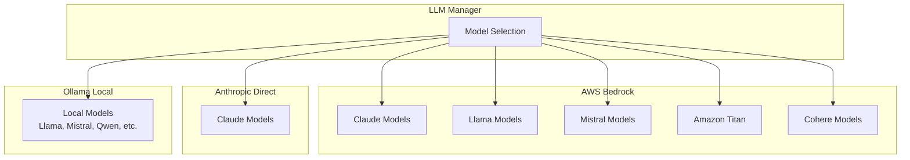

### AWS Bedrock
- Access to Claude, Llama, Mistral, Cohere, Titan, and AI21 models
- Requires AWS credentials and Bedrock model access
- Supports cost tracking and usage monitoring

### Anthropic Direct API
- Direct access to Claude models
- Useful when AWS is not available
- Requires Anthropic API key
- Includes rate limit handling with exponential backoff
- Default tier: 30,000 input tokens/minute (large requests auto-detected and skipped)

### Ollama
- Run models locally for privacy
- No internet connection required after model download
- Support for Llama, Mistral, Qwen, CodeLlama, and many more

### Model Switching
- Change models mid-conversation with `changemodel` command
- Per-model token tracking shows usage breakdown
- Model can be locked via configuration for consistency

---

## Web Search (Anthropic)

Anthropic models can search the web for current information during conversations, providing access to real-time data beyond the model's training cutoff.

### Overview

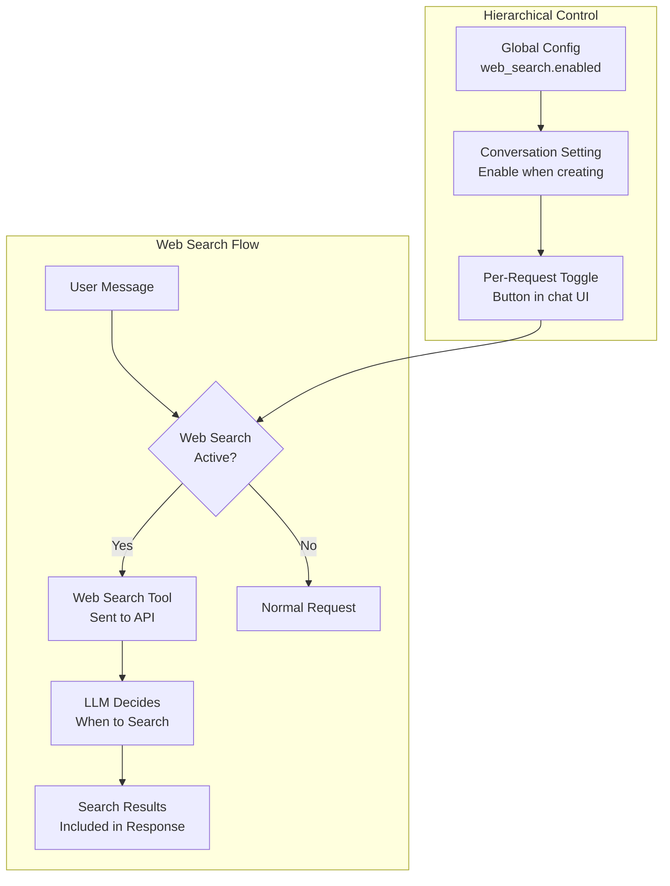

### Hierarchical Control

Web search is controlled at three levels:

| Level | Control | Description |
|-------|---------|-------------|
| **Global** | `config.yaml` | Master switch - if disabled, web search is unavailable entirely |
| **Conversation** | When creating | Checkbox appears for Anthropic models if globally enabled |
| **Request** | Chat UI toggle | Per-message toggle, defaults to ON when conversation has web search enabled |

### Enabling Web Search

#### 1. Global Configuration

Enable in `config.yaml` under `llm_providers.anthropic`:

```yaml
anthropic:
  enabled: true
  api_key: SEC/anthropic_api_key
  web_search:
    enabled: true  # Master switch
    max_uses_per_request: 5
```

Or enable during setup wizard:

```
Do you wish to use Anthropic Direct API? [y/N]: y
Anthropic API key: ********
Enable web search capability for Anthropic models? ($0.01 per search) [y/N]: y
```

#### 2. Conversation Creation

When creating a new conversation with an Anthropic model, a checkbox appears:

```
☑ Enable web search ($0.01 per search)
  When enabled, the AI can search the web for current information.
```

#### 3. Per-Request Toggle

In the chat interface, a globe button appears next to the send button for web-search-enabled conversations:

| State | Button Style | Behaviour |
|-------|--------------|-----------|
| ON (default) | Solid blue | Web search tool included in request |
| OFF | Outline grey | Web search tool excluded |

### Configuration Options

```yaml
web_search:
  enabled: false                 # Master switch
  max_uses_per_request: 5        # Limit searches per API call
  allowed_domains: []            # Restrict to specific domains
  blocked_domains: []            # Block specific domains
  user_location:                 # Localise search results
    city: null
    region: null
    country: null
    timezone: null
```

### Domain Filtering

Optionally restrict or block specific domains:

```yaml
# Only search documentation sites
allowed_domains:
  - "docs.python.org"
  - "developer.mozilla.org"
  - "docs.aws.amazon.com"

# Or block certain sites
blocked_domains:
  - "example-blocked.com"
```

**Note**: Only one of `allowed_domains` or `blocked_domains` can be active at a time.

### User Location

Provide location context for localised search results:

```yaml
user_location:
  city: "Sydney"
  region: "New South Wales"
  country: "AU"
  timezone: "Australia/Sydney"
```

### Pricing

| Component | Cost |
|-----------|------|
| Web search | $0.01 per search |
| Search results | Standard token costs |

The LLM decides when and how often to search based on the user's query. The `max_uses_per_request` setting limits how many searches can occur in a single API call.

### How It Works

1. When enabled, the web search tool is included in API requests to Anthropic
2. The LLM autonomously decides when to search based on the user's query
3. Search results are returned as part of the response
4. Results include source URLs for verification

### Use Cases

- **Current Events**: News, recent developments, live data
- **Technical Documentation**: Latest API references, framework docs
- **Research**: Academic papers, industry reports
- **Fact-Checking**: Verify claims with current sources

---

## Conversation Management

Spark provides comprehensive conversation management:

### Creating Conversations
1. Name the conversation
2. Select LLM model (unless locked)
3. Optionally provide system instructions
4. Optionally attach files

### Conversation Features
- **Persistent History**: All conversations stored in database
- **Resume Anytime**: Load and continue previous conversations
- **Per-Conversation Settings**: Custom max_tokens and compaction thresholds
- **File Attachments**: Attach text, code, and data files

### Instructions Hierarchy

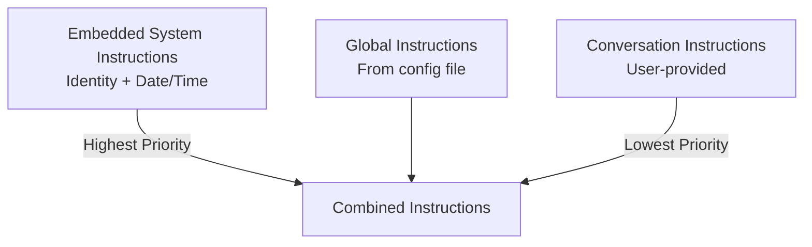

1. **Embedded System Instructions** - Always present, defines Spark's identity
2. **Global Instructions** - Optional file-based instructions for all conversations
3. **Conversation Instructions** - User-provided per-conversation instructions

---

## Intelligent Context Compaction

Spark uses an intelligent, LLM-driven context compaction system that preserves critical information while reducing token usage.

### How It Works

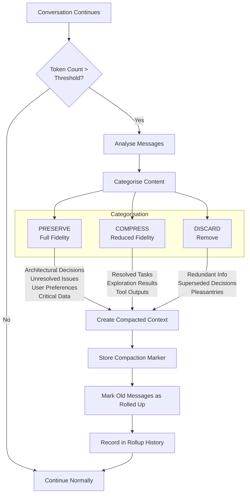

### Categorisation Rules

| Category | Content Type | Treatment |
|----------|-------------|-----------|
| **PRESERVE** | Architectural decisions, unresolved bugs, implementation details, user preferences, critical data, active tasks | Kept in full fidelity |
| **COMPRESS** | Resolved tasks, exploratory discussion, tool outputs, explanations | Brief summary only |
| **DISCARD** | Redundant information, superseded decisions, verbose completions, pleasantries | Removed |

### Numerical Data Preservation

The compaction system specially handles numerical data to prevent information loss:

1. **Extraction**: Parses tool results for currency amounts, percentages, and large numbers
2. **Preservation**: Includes extracted numbers in compaction prompt with "CRITICAL - NUMERICAL DATA DETECTED"
3. **Verification**: Warns users when synthesis documents are created, suggesting verification

### Configuration

```yaml
conversation:
  rollup_threshold: 0.3              # Trigger at 30% of context window
  rollup_summary_ratio: 0.3          # Target 30% reduction
  emergency_rollup_threshold: 0.95   # Force during tool use at 95%
```

### Model-Specific Context Windows

The system knows each model's context window size:

```yaml
model_context_limits:
  anthropic:
    claude-sonnet-4:
      context_window: 200000
      max_output: 64000
  ollama:
    llama3.2:
      context_window: 128000
      max_output: 8192
```

### Rate Limit Protection

Compaction requests are checked against provider rate limits before execution to prevent infinite retry loops with rate-limited APIs.

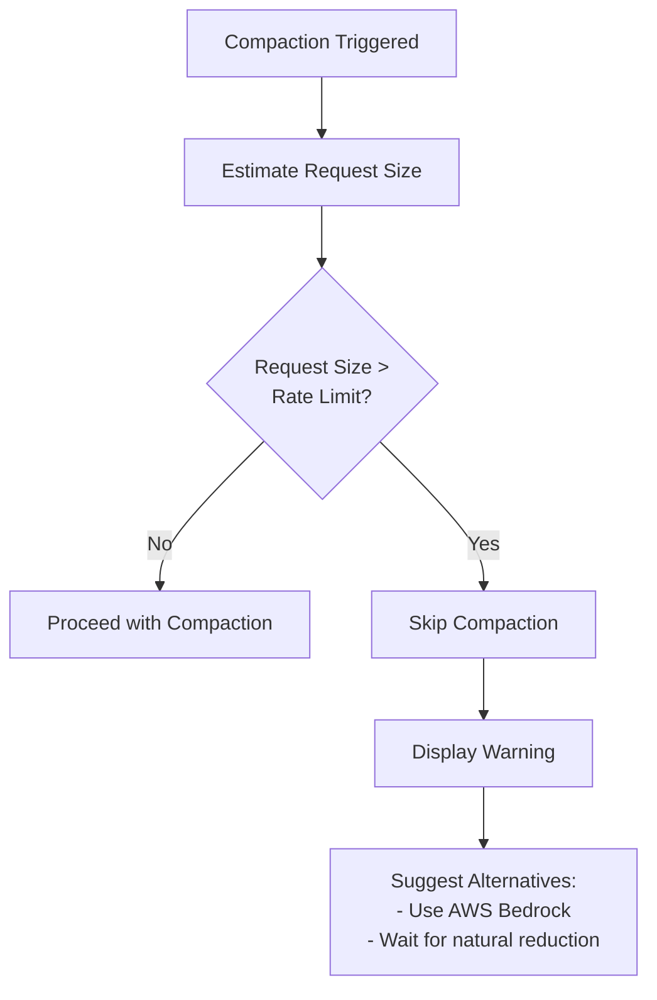

**Provider Rate Limits:**

| Provider | Input Tokens/Min | Behaviour |
|----------|------------------|-----------|
| **Anthropic Direct** | 30,000 | Checked before compaction |
| **AWS Bedrock** | Much higher | No practical limit |
| **Ollama** | None (local) | No limit checks |

**When Rate Limited:**

If a compaction request would exceed the provider's rate limit, the system:

1. Skips the compaction attempt (prevents infinite retry loops)
2. Displays a warning with the estimated vs. allowed tokens
3. Suggests alternatives:
   - Switch to AWS Bedrock for higher rate limits
   - Wait for the conversation to naturally reduce in size
   - Start a new conversation if appropriate

This protection applies to both conversation compaction and autonomous action compaction.

---

## Tool Integration

Spark supports tools from multiple sources:

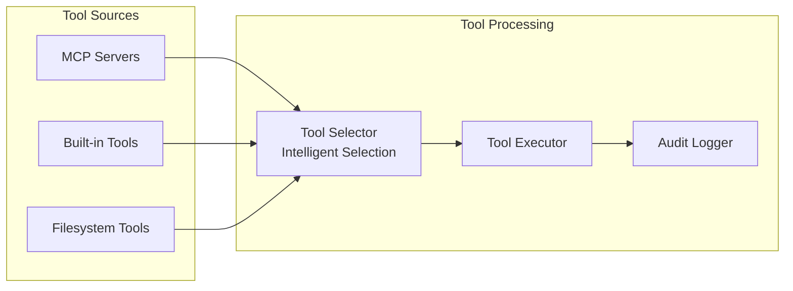

### Tool Selection
- Intelligent selection based on user message context
- Limits tools per request to prevent token overflow
- Built-in tools always included
- Duplicate tool names auto-resolved with server prefix

### Tool Use Loop
- Maximum iterations configurable (default: 25)
- Rollup deferred during tool sequences
- Tool results truncated to prevent context overflow

### MCP Server Transports

Spark supports three transport types for connecting to MCP servers:

| Transport | Description | Use Case |
|-----------|-------------|----------|
| **stdio** | Local process via stdin/stdout | Local tools, development |
| **http** | Streamable HTTP (remote) | Cloud services, remote APIs |
| **sse** | Server-Sent Events (remote) | Real-time streaming, event-driven |

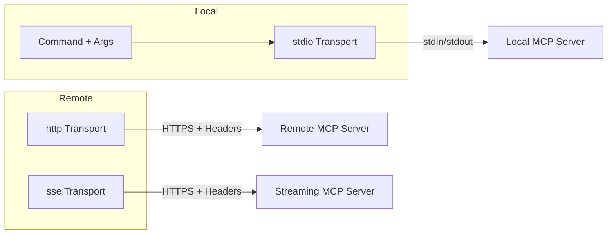

### MCP Authentication

For remote MCP servers (http/sse), multiple authentication methods are supported:

| Auth Type | Header Format | Use Case |
|-----------|---------------|----------|
| **none** | No auth headers | Local/trusted networks |
| **bearer** | `Authorization: Bearer <token>` | OAuth, JWT tokens |
| **api_key** | `X-API-Key: <key>` (customisable) | API key authentication |
| **basic** | `Authorization: Basic <base64>` | HTTP Basic auth |
| **custom** | User-defined headers | Complex auth schemes |

**Configuration Example:**

```yaml
mcp_config:
  enabled: true
  servers:
    # Local stdio server
    - name: local-tools
      transport: stdio
      command: python
      args: ["-m", "my_mcp_server"]
      enabled: true

    # Remote HTTP with Bearer token
    - name: cloud-api
      transport: http
      url: https://api.example.com/mcp
      auth_type: bearer
      auth_token: ${API_TOKEN}  # Environment variable
      timeout: 60
      enabled: true

    # SSE with API key
    - name: event-stream
      transport: sse
      url: https://events.example.com/mcp
      auth_type: api_key
      auth_token: ${SSE_KEY}
      auth_header_name: X-API-Key
      timeout: 120
      enabled: true

    # HTTP with Basic auth
    - name: internal-service
      transport: http
      url: https://internal.example.com/mcp
      auth_type: basic
      basic_username: ${SERVICE_USER}
      basic_password: ${SERVICE_PASS}
      enabled: true

    # Custom headers for complex auth
    - name: custom-auth
      transport: http
      url: https://custom.example.com/mcp
      auth_type: custom
      custom_headers:
        X-Tenant-ID: "my-tenant"
        X-Custom-Auth: "secret-value"
      enabled: true
```

### SSL Certificate Verification

For remote MCP servers using HTTPS, SSL certificate verification is enabled by default. When connecting to servers with self-signed certificates (common in development or internal environments), you can disable verification:

| Option | Default | Description |
|--------|---------|-------------|
| `ssl_verify` | `true` | Verify SSL certificates |

**Warning:** Disabling SSL verification reduces security. Only use for:
- Development/testing environments with self-signed certificates
- Internal servers with custom certificate authorities

**Configuration Example:**

```yaml
mcp_config:
  servers:
    # Development server with self-signed certificate
    - name: dev-server
      transport: http
      url: https://dev-internal.local:8443/mcp
      auth_type: api_key
      auth_token: dev-api-key
      ssl_verify: false  # Skip SSL verification
      timeout: 30
      enabled: true

    # SSE with self-signed certificate
    - name: dev-events
      transport: sse
      url: https://dev-events.local:8443/mcp
      auth_type: bearer
      auth_token: dev-bearer-token
      ssl_verify: false  # Skip SSL verification
      timeout: 120
      enabled: true
```

---

## Built-in Filesystem Tools

Spark includes built-in filesystem tools that provide LLM access to local files without requiring an MCP server.

### Available Tools

| Tool | Description | Access Mode |
|------|-------------|-------------|
| `list_files_recursive` | List all files and directories | Read |
| `search_files` | Search by filename pattern (wildcards) | Read |
| `read_file_text` | Read text file contents | Read |
| `read_file_binary` | Read binary files (base64) | Read |
| `write_file` | Write content to file | Read/Write |
| `create_directories` | Create directory structure | Read/Write |

### Security Features

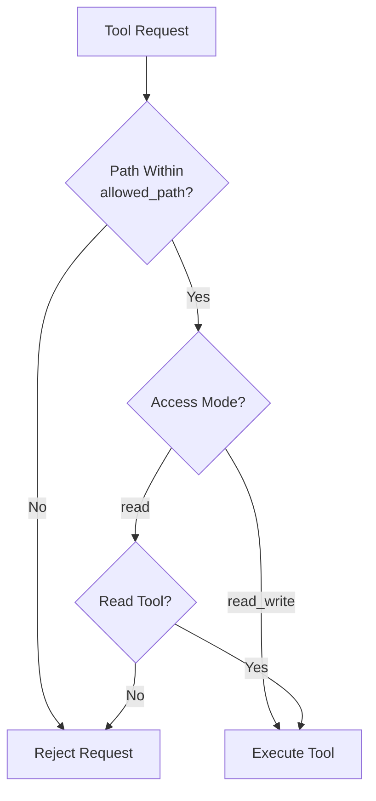

- **Path Validation**: All paths validated to be within `allowed_path`
- **Traversal Prevention**: `../` and absolute paths outside allowed directory blocked
- **Access Mode Control**: Read-only mode disables write operations
- **Size Limits**: Binary reads have configurable size limits

### Configuration

```yaml
embedded_tools:
  filesystem:
    enabled: true
    allowed_path: ./working       # Root directory for access
    access_mode: read_write       # read or read_write
```

---

## Tool Approval Process

Spark implements a permission system for tool execution:

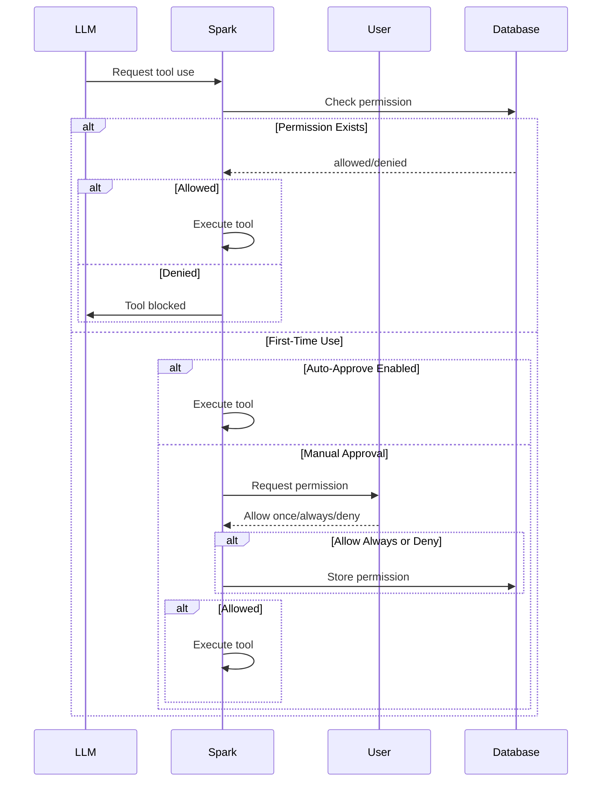

### Permission States

| State | Stored | Behaviour |
|-------|--------|-----------|
| Not Used | No | Prompt user (unless auto_approve) |
| Allowed | Yes | Execute without prompting |
| Denied | Yes | Block execution |
| Once | No | Allow this time, prompt again next time |

### User Choices

When prompted for first-time tool use:

1. **Allow once** - Run this time only, don't store
2. **Allow always** - Run and store "allowed"
3. **Deny** - Block and store "denied"
4. **Cancel** - Skip this time, don't store

### Configuration

```yaml
tool_permissions:
  auto_approve: false    # true = skip prompts (development use)
```

---

## MCP Audit Logging

All MCP tool executions are logged for security audit:

### Logged Information

| Field | Description |
|-------|-------------|
| `conversation_id` | Which conversation triggered the call |
| `user_prompt` | The user message that triggered tool use |
| `tool_name` | Name of the tool called |
| `tool_server` | MCP server that provided the tool |
| `tool_input` | Input parameters sent to tool |
| `tool_response` | Response returned by tool |
| `is_error` | Whether the call resulted in an error |
| `execution_time_ms` | How long the call took |
| `timestamp` | When the call occurred |
| `user_guid` | Which user made the call |

### Accessing Audit Logs

Use the `mcpaudit` command during chat:

```
> mcpaudit

MCP Transaction Audit
─────────────────────────────────────────
1. 2024-12-05 10:30:15 | filesystem | list_files_recursive
   Input: {"path": "./src"}
   Duration: 45ms
   Status: Success

2. 2024-12-05 10:30:18 | filesystem | read_file_text
   Input: {"path": "./src/main.py"}
   Duration: 12ms
   Status: Success
```

### Export to CSV

Export audit logs for compliance or analysis:

```
> mcpaudit
Options: [f]ilter, [e]xport, [q]uit: e
Export filename: audit_2024_12.csv
✓ Exported 150 transactions to audit_2024_12.csv
```

---

## Database Support & Multi-User

### Supported Databases

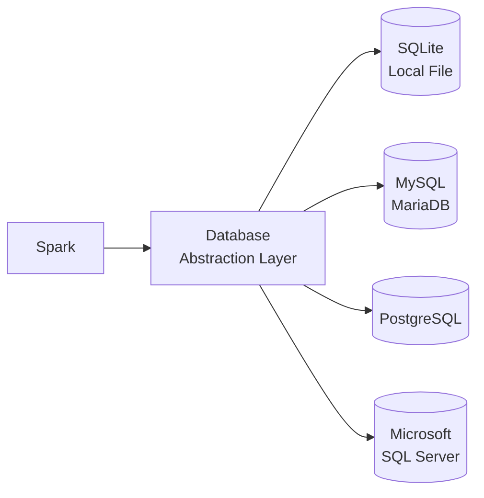

| Database | Use Case | Configuration |
|----------|----------|---------------|
| SQLite | Single user, local deployment | Default, no setup |
| MySQL/MariaDB | Multi-user, centralised | `pip install mysql-connector-python` |
| PostgreSQL | Enterprise, advanced features | `pip install psycopg2-binary` |
| MSSQL | Windows enterprise | `pip install pyodbc` |

### Multi-User Separation

Spark uses a unique user GUID to separate data:

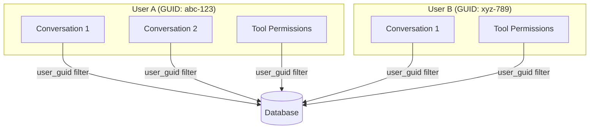

### Data Isolation

Each user can only access their own:
- Conversations
- Messages
- Tool permissions
- MCP transactions
- File attachments
- Usage statistics

The `user_guid` is automatically applied to all database queries, ensuring complete data isolation even in shared database deployments.

### Schema Migration

The database schema auto-migrates on startup:
- New columns added automatically
- Existing data preserved
- Backward compatible with older databases

---

## Conversation Export

Export conversations in multiple formats for archiving or sharing.

### Supported Formats

| Format | Extension | Features |
|--------|-----------|----------|
| Markdown | `.md` | Clean, readable, portable |
| HTML | `.html` | Beautiful chat-style display |
| CSV | `.csv` | Spreadsheet-compatible |

### Export Content

Exports include **complete history** including:
- All user messages
- All assistant responses
- Rolled-up/compacted messages
- Tool call details (optional)
- Tool results (optional)

### Message Type Distinction

Each format distinguishes message types:

| Type | Markdown Header | HTML Style | CSV Column |
|------|-----------------|------------|------------|
| User | 👤 User | Purple gradient, right | "Message" |
| Assistant | 🤖 Assistant | Grey, left | "Message" |
| Rollup Summary | 📋 Rollup Summary | Green, centered | "Rollup Summary" |
| Tool Call | 🛠️ Tool Call | Blue, left | "Tool Call" |
| Tool Results | 🔧 Tool Results | Amber, centered | "Tool Results" |

### How to Export

Use the `export` command during chat:

```
> export

Export Conversation
─────────────────────────────────────────
Select format:
  [1] Markdown (.md)
  [2] HTML (.html)
  [3] CSV (.csv)

Choice: 1

Include tool call details? (y/n): y

Filename [conversation_2024-12-05_103045.md]: my_export.md

✓ Conversation exported to my_export.md
```

### HTML Export Features

The HTML export includes:
- Modern chat bubble design
- Dark/light theme support
- Message type colour coding
- Timestamps
- Fade-in animations
- Responsive layout

---

## Prompt Security Inspection

Protect against prompt injection and other security threats.

### Inspection Flow

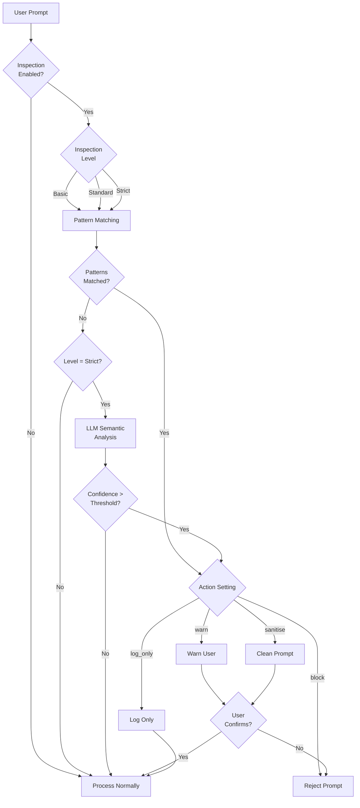

### Inspection Levels

| Level | Checks | Performance |
|-------|--------|-------------|
| **Basic** | Regex pattern matching | Very fast |
| **Standard** | Patterns + keyword analysis | Fast |
| **Strict** | Patterns + LLM semantic analysis | Slower, most thorough |

### Pattern Detection

Built-in patterns detect:

| Pattern | Description |
|---------|-------------|
| Prompt Injection | Attempts to override system instructions |
| Jailbreak | Attempts to bypass safety guidelines |
| Code Injection | Malicious code patterns |
| PII Exposure | Potential personal information leakage |
| Excessive Length | Unusually long prompts |

### LLM-Based Analysis

For strict level, the LLM analyser:

1. Sends prompt to a fast, inexpensive model (e.g., Claude Haiku)
2. Asks for security risk assessment
3. Returns confidence score (0.0-1.0)
4. Triggers action if above threshold

### Configuration

```yaml
prompt_inspection:
  enabled: true
  inspection_level: standard
  action: warn

  llm_inspection:
    enabled: true
    model: anthropic.claude-3-haiku-20240307-v1:0
    provider: AWS Bedrock
    confidence_threshold: 0.7

  patterns:
    check_prompt_injection: true
    check_jailbreak: true
    check_code_injection: true
    check_pii: false
    max_prompt_length: 50000

  log_violations: true
  alert_on_repeated_violations: true
  violation_threshold: 5
```

### Violation Logging

All violations are logged to the database for audit:
- Timestamp
- User GUID
- Violation type
- Matched pattern or LLM assessment
- Action taken
- User's response (if warned)

---

## Autonomous Actions

Schedule AI-driven tasks to run automatically at specified times, with full tool access and result tracking.

### Overview

Autonomous Actions allow you to define tasks in natural language that execute automatically according to a schedule. Each action:

- Runs with a locked model (specified at creation time)
- Has explicit tool permissions (selected during setup)
- Can run once or on a recurring schedule
- Tracks execution history with exportable results

### Schedule Types

| Type | Description | Configuration |
|------|-------------|---------------|
| **One-off** | Runs once at a specific date/time | ISO datetime: `2025-12-20T14:30:00` |
| **Recurring** | Runs on a schedule (cron expression) | Cron: `0 9 * * MON` (9am every Monday) |

### Context Modes

| Mode | Description | Use Case |
|------|-------------|----------|
| **Fresh** | Starts with empty context each run | Independent tasks, reports |
| **Cumulative** | Builds on previous run's context | Ongoing analysis, tracking changes |

### Creating an Autonomous Action

There are two ways to create an autonomous action:

#### Via CLI Wizard (Manual)

The step-by-step wizard guides you through each field:

1. **Name and Description** - Identify the action
2. **Action Prompt** - Natural language instruction for the AI
3. **Model Selection** - Choose and lock the LLM model
4. **Tool Selection** - Explicitly select which tools the action may use
5. **Schedule Type** - One-off or recurring
6. **Schedule Configuration** - Datetime or cron expression
7. **Context Mode** - Fresh or cumulative
8. **Failure Threshold** - Auto-disable after N failures (default: 3)

#### Via Prompt-Driven Conversation (AI-Assisted)

Use the conversational approach for a more natural creation experience:

**How it works:**

1. **Select Model** - Choose the LLM (becomes locked for both creation AND execution)
2. **Describe Task** - Explain what you want to schedule in plain language
3. **Conversation Loop** - The LLM asks clarifying questions if needed:
   - Schedule timing (e.g., "Every weekday at 8am" vs "Every day")
   - Specific actions the AI should take
   - Whether results should persist across runs (context mode)
   - What tools/capabilities are needed
4. **Tool Inference** - The LLM suggests appropriate tools based on your description
5. **Summary & Confirmation** - Review the proposed configuration before creation
6. **Exit** - Type `cancel` at any time to abort

**Available Creation Tools:**

| Tool | Purpose |
|------|---------|
| `list_available_tools` | Shows all tools that can be assigned to the action |
| `validate_schedule` | Validates cron expressions or datetime formats |
| `create_autonomous_action` | Creates the action after user confirmation |

**Example Flow:**

```
You: I want to analyse AWS Bedrock costs every weekday morning
     and save a report to the reports folder

Assistant: I'll help you create that action. Based on your task, I recommend:
           - get_aws_bedrock_costs (retrieves AWS usage)
           - write_file (saves the report)

           Schedule: Weekdays at 8:00 AM (cron: 0 8 * * MON-FRI)
           Context: Fresh

           Shall I create this action?

You: Yes
```

### Tool Permission Snapshots

When you create an action, tool permissions are snapshotted at creation time. This ensures:
- Actions only use explicitly approved tools
- Tool permissions don't change unexpectedly
- Security review at action creation time

### Cron Expression Examples

| Expression | Description |
|------------|-------------|
| `0 9 * * *` | Every day at 9:00 AM |
| `0 9 * * MON` | Every Monday at 9:00 AM |
| `0 */6 * * *` | Every 6 hours |
| `0 9 1 * *` | First day of each month at 9:00 AM |
| `0 9 * * MON-FRI` | Weekdays at 9:00 AM |
| `30 8,17 * * *` | 8:30 AM and 5:30 PM daily |

### Security Considerations

1. **Tool Permissions**: Explicitly selected at creation time
2. **Model Lock**: Cannot be changed after action creation
3. **Sequential Execution**: Actions run one at a time (no parallel execution)
4. **User Isolation**: Actions scoped to user_guid in multi-user deployments
5. **Audit Trail**: All executions logged with full details

---

## Next Steps

- [CLI Reference](cli-reference.md) - All commands and options
- [Web Interface](web-interface.md) - Browser-based usage
- [MCP Integration](mcp-integration.md) - External tool setup
- [Security](security.md) - Security best practices
