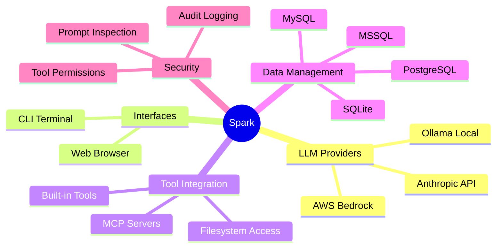
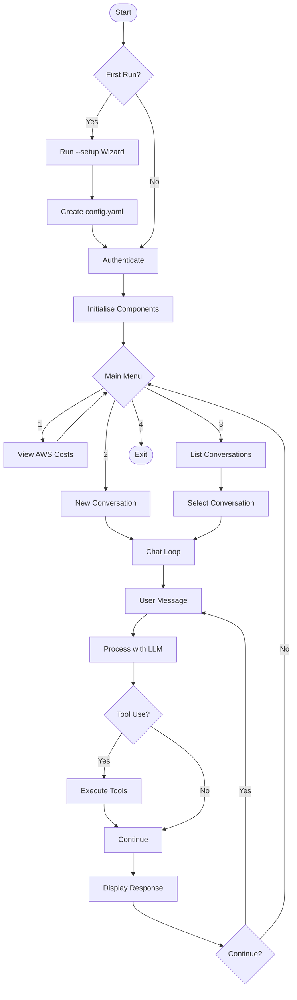
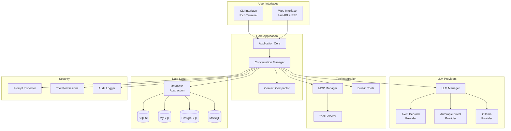

# Spark Documentation

Welcome to the Spark documentation. Spark (Secure Personal AI Research Kit) is a comprehensive multi-provider LLM interface designed for conversational AI with advanced tool integration capabilities.

## What is Spark?

Spark provides a unified interface to interact with large language models from multiple providers:

- **AWS Bedrock** - Access Claude, Llama, Mistral, Cohere, Titan, and other models through AWS
- **Anthropic Direct API** - Direct access to Claude models without AWS infrastructure
- **Ollama** - Run open-source models locally for privacy and offline use

## Key Capabilities



## Documentation Contents

### Getting Started

- **[Installation Guide](installation.md)** - How to install Spark and its dependencies
- **[Configuration Reference](configuration.md)** - Complete guide to config.yaml settings

### Features

- **[Features Guide](features.md)** - Detailed documentation of all Spark features
- **[CLI Reference](cli-reference.md)** - Command-line options and chat commands
- **[Web Interface](web-interface.md)** - Using the browser-based interface

### Integration

- **[MCP Integration](mcp-integration.md)** - Connecting external tools via Model Context Protocol
- **[Security](security.md)** - Security features, prompt inspection, and best practices

## Quick Start

### 1. Install Spark

```bash
pip install dtSpark
```

### 2. Run Setup Wizard

```bash
spark --setup
```

### 3. Start Spark

```bash
spark
```

## Application Flow



## Architecture



## Support

- **Issues**: [GitHub Issues](https://github.com/digital-thought/dtSpark/issues)
- **Email**: matthew@digital-thought.org

---

*Spark - Secure Personal AI Research Kit*
*Copyright 2024-2025 Matthew Westwood-Hill*
