# Installation Guide

This guide covers all installation methods for Spark.

## Requirements

### System Requirements

- **Python**: 3.10 or higher
- **Operating System**: Windows, macOS, or Linux
- **Memory**: 512MB minimum (more for large conversations)
- **Disk Space**: 100MB for installation

### Provider Requirements

Depending on which LLM providers you want to use:

| Provider | Requirements |
|----------|-------------|
| AWS Bedrock | AWS account with Bedrock access, AWS CLI configured |
| Anthropic API | Anthropic API key |
| Google Gemini | Google API key (from AI Studio) |
| Ollama | Ollama server running locally or on network |

## Installation Methods

### From PyPI (Recommended)

```bash
pip install dtSpark
```

### From Source

```bash
git clone https://github.com/digital-thought/dtSpark.git
cd spark
pip install -e .
```

### With Optional Database Support

Spark uses SQLite by default, but supports other databases:

```bash
# MySQL/MariaDB support
pip install dtSpark[mysql]

# PostgreSQL support
pip install dtSpark[postgresql]

# Microsoft SQL Server support
pip install dtSpark[mssql]

# All database backends
pip install dtSpark[all-databases]
```

### Development Installation

For development with testing tools:

```bash
pip install dtSpark[dev]
```

## First-Time Setup

### Interactive Setup Wizard

The easiest way to configure Spark is using the setup wizard:

```bash
spark --setup
```

The wizard guides you through:

```mermaid
flowchart TD
    START([spark --setup]) --> SPLASH[Display SPARK Logo]
    SPLASH --> CONTEXT[Show Setup Context]

    CONTEXT --> LLM[LLM Provider Selection]
    LLM --> AWS{Use AWS<br/>Bedrock?}
    AWS -->|Yes| AWS_CFG[Configure AWS]
    AWS -->|No| OLLAMA
    AWS_CFG --> OLLAMA{Use Ollama?}
    OLLAMA -->|Yes| OLLAMA_CFG[Configure Ollama URL]
    OLLAMA -->|No| ANTHROPIC
    OLLAMA_CFG --> ANTHROPIC{Use Anthropic<br/>Direct?}
    ANTHROPIC -->|Yes| ANTHROPIC_CFG[Enter API Key]
    ANTHROPIC -->|No| GEMINI
    ANTHROPIC_CFG --> GEMINI{Use Google<br/>Gemini?}
    GEMINI -->|Yes| GEMINI_CFG[Enter API Key]
    GEMINI -->|No| DATABASE
    GEMINI_CFG --> DATABASE

    DATABASE[Database Selection]
    DATABASE --> DB_TYPE{Select Type}
    DB_TYPE -->|SQLite| INTERFACE
    DB_TYPE -->|MySQL/MariaDB| DB_REMOTE[Configure Connection]
    DB_TYPE -->|PostgreSQL| DB_REMOTE
    DB_TYPE -->|MSSQL| DB_REMOTE
    DB_REMOTE --> INTERFACE

    INTERFACE[Interface Selection]
    INTERFACE --> IF_TYPE{CLI or Web?}
    IF_TYPE -->|CLI| MODEL_CFG
    IF_TYPE -->|Web| WEB_CFG[Configure SSL/Theme]
    WEB_CFG --> MODEL_CFG

    MODEL_CFG[Model Configuration]
    MODEL_CFG --> FEATURES[Additional Features]
    FEATURES --> MCP{Enable MCP?}
    MCP --> FS{Enable Filesystem<br/>Tools?}
    FS --> SECURITY{Enable Prompt<br/>Inspection?}
    SECURITY --> SAVE[Save config.yaml]
    SAVE --> DONE([Setup Complete])
```



### What the Wizard Configures

1. **LLM Providers**
   - AWS Bedrock (profile, region, cost tracking)
   - Ollama (server URL)
   - Anthropic Direct API (API key securely stored)
   - Google Gemini (API key securely stored)

2. **Database**
   - SQLite (default, no configuration needed)
   - MySQL/MariaDB (host, port, credentials)
   - PostgreSQL (host, port, credentials)
   - Microsoft SQL Server (host, port, driver)

3. **Interface**
   - CLI or Web mode
   - Web SSL and theme settings

4. **Model Settings**
   - Maximum tokens per response
   - Temperature

5. **Additional Features**
   - MCP tool integration
   - Embedded filesystem tools
   - Tool permission mode
   - Prompt security inspection

### Manual Configuration

Alternatively, create `config.yaml` manually. See [Configuration Reference](configuration.md) for all options.

The configuration file location:
- **Windows**: `%APPDATA%\dtSpark\config\config.yaml`
- **macOS**: `~/Library/Application Support/dtSpark/config/config.yaml`
- **Linux**: `~/.local/share/dtSpark/config/config.yaml`

## Provider Setup

### AWS Bedrock Setup

1. **Configure AWS CLI**:
   ```bash
   aws configure sso
   ```

2. **Login to AWS SSO**:
   ```bash
   aws sso login --profile default
   ```

3. **Verify Access**:
   ```bash
   aws sts get-caller-identity --profile default
   ```

4. **Enable Bedrock Models**:
   - Go to AWS Console → Bedrock → Model Access
   - Request access to desired models (Claude, Llama, etc.)

### Anthropic Direct API Setup

1. **Get API Key**:
   - Visit [console.anthropic.com](https://console.anthropic.com)
   - Create an API key

2. **Configure in Spark**:
   - Run `spark --setup` and enter the key when prompted
   - Or set environment variable: `ANTHROPIC_API_KEY=sk-ant-...`

### Google Gemini Setup

1. **Get API Key**:
   - Visit [Google AI Studio](https://aistudio.google.com/apikey)
   - Create an API key

2. **Install Optional Package** (if not already installed):
   ```bash
   pip install google-genai
   ```

3. **Configure in Spark**:
   - Run `spark --setup` and enter the key when prompted
   - Or set environment variable: `GEMINI_API_KEY=your-key` or `GOOGLE_API_KEY=your-key`

4. **Optional: Enable Web Search (Grounding)**:
   - During setup, enable "Google Search grounding capability"
   - Allows Gemini to search the web for current information
   - Pricing: Per search query (2.0+) or per prompt (1.5)

### Ollama Setup

1. **Install Ollama**:
   ```bash
   # macOS/Linux
   curl -fsSL https://ollama.com/install.sh | sh

   # Windows - download from https://ollama.com
   ```

2. **Pull a Model**:
   ```bash
   ollama pull llama3.2
   ollama pull mistral
   ```

3. **Start Ollama Server**:
   ```bash
   ollama serve
   ```

4. **Configure in Spark**:
   - Default URL: `http://localhost:11434`
   - For remote server, specify full URL in setup

## Verifying Installation

After installation, verify everything works:

```bash
# Check Spark is installed
spark --help

# Run setup wizard
spark --setup

# Start Spark
spark
```

## Upgrading

```bash
# Upgrade to latest version
pip install --upgrade dtSpark

# Check current version
spark --version
```

## Troubleshooting

### Common Issues

**Import Errors**
```bash
# Ensure all dependencies are installed
pip install dtSpark --force-reinstall
```

**AWS Authentication Failures**
```bash
# Re-authenticate
aws sso login --profile default
```

**Ollama Connection Refused**
```bash
# Start Ollama server
ollama serve

# Check it's running
curl http://localhost:11434/api/version
```

**Database Errors**
```bash
# For MySQL
pip install mysql-connector-python

# For PostgreSQL
pip install psycopg2-binary

# For MSSQL
pip install pyodbc
```

## Next Steps

- [Configuration Reference](configuration.md) - Customise your setup
- [Features Guide](features.md) - Learn about all features
- [CLI Reference](cli-reference.md) - Master the command line
