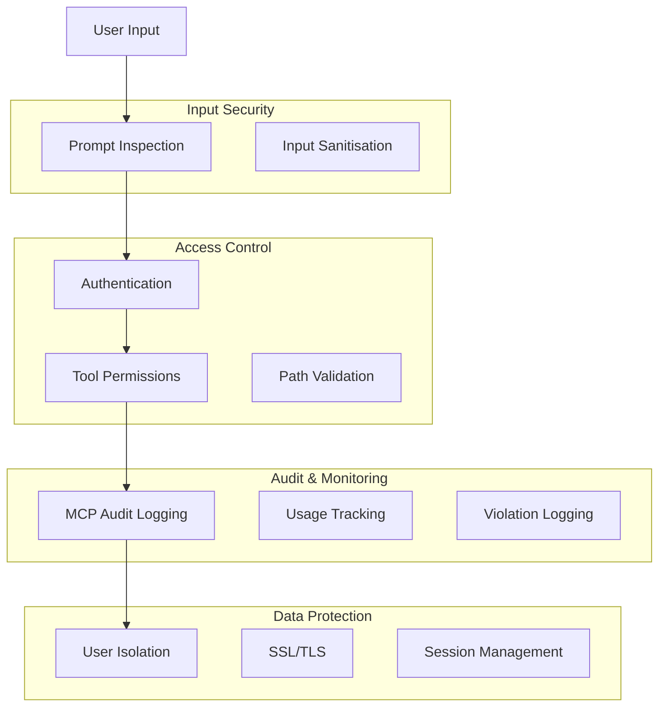
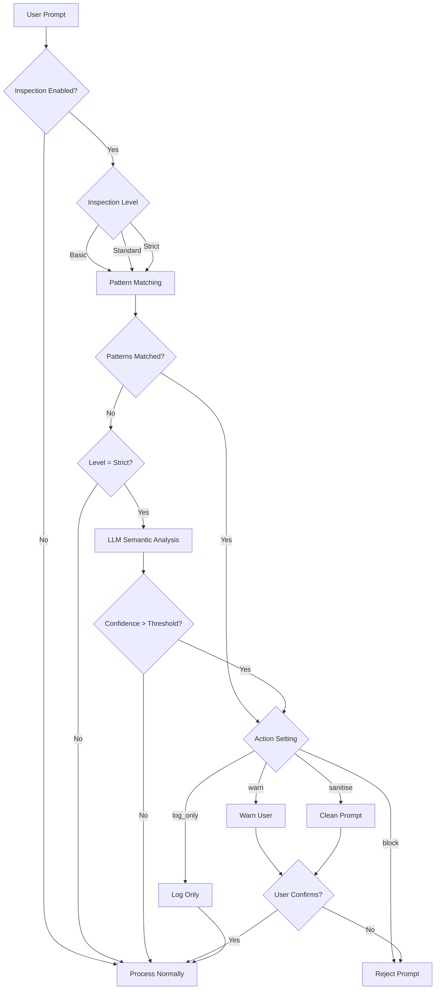
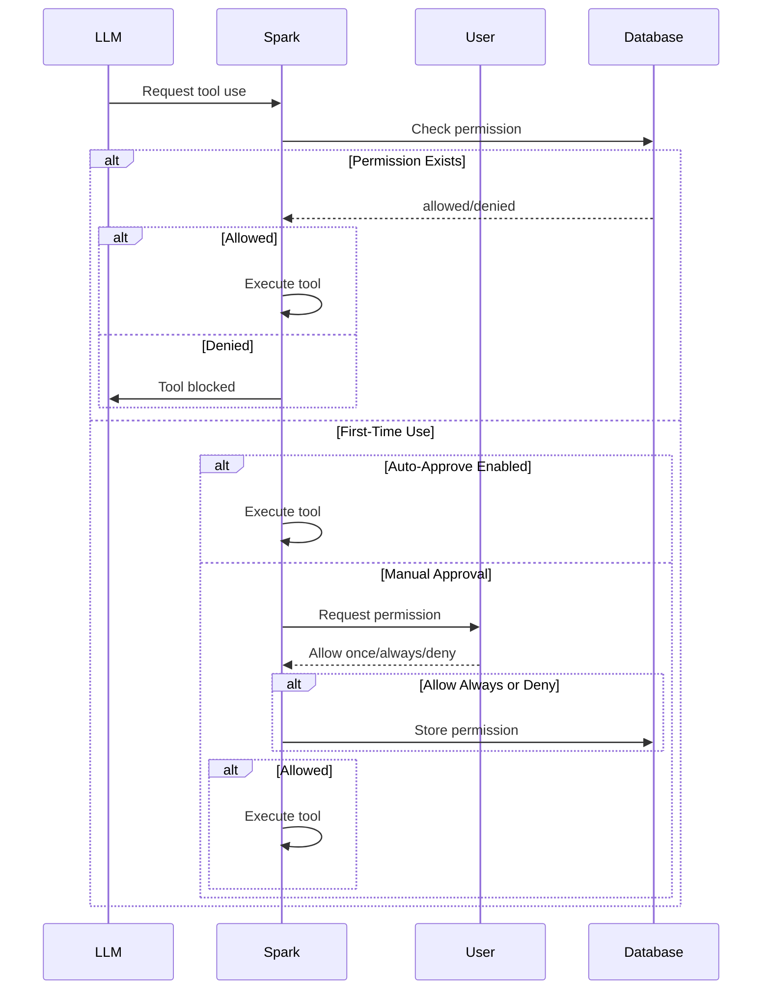
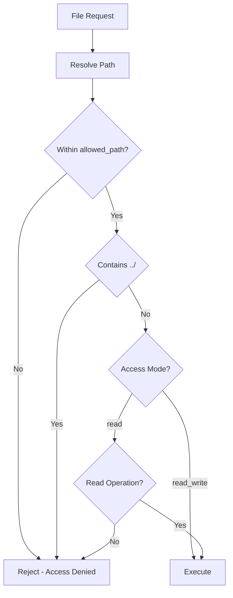
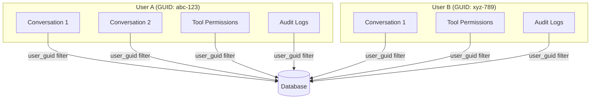
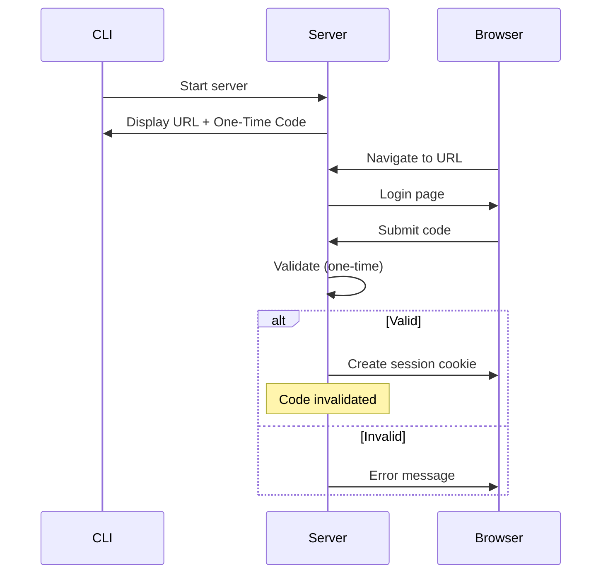

# Security Guide

Spark includes multiple security features to protect your data and prevent misuse.

## Security Architecture



---

## Prompt Security Inspection

### Overview

Protect against prompt injection and other security threats with multi-level inspection.



### Configuration

```yaml
prompt_inspection:
  enabled: true
  inspection_level: standard  # basic, standard, strict
  action: warn                # block, warn, sanitise, log_only

  # LLM-based inspection (strict level)
  llm_inspection:
    enabled: true
    model: anthropic.claude-3-haiku-20240307-v1:0
    provider: AWS Bedrock
    max_tokens: 500
    confidence_threshold: 0.7

  # Pattern-based detection
  patterns:
    check_prompt_injection: true
    check_jailbreak: true
    check_code_injection: true
    check_pii: false
    check_excessive_length: true
    max_prompt_length: 50000

  # Logging and alerts
  log_violations: true
  alert_on_repeated_violations: true
  violation_threshold: 5
```

### Inspection Levels

| Level | Checks | Performance | Use Case |
|-------|--------|-------------|----------|
| **Basic** | Regex patterns only | Very fast | Production, high volume |
| **Standard** | Patterns + keyword analysis | Fast | Balanced security |
| **Strict** | Patterns + LLM analysis | Slower | High security environments |

### Detection Patterns

| Pattern | Description | Examples |
|---------|-------------|----------|
| **Prompt Injection** | Attempts to override instructions | "Ignore previous instructions" |
| **Jailbreak** | Bypass safety guidelines | "DAN mode", "pretend you're evil" |
| **Code Injection** | Malicious code patterns | SQL injection, shell commands |
| **PII Exposure** | Personal information leakage | SSN patterns, credit cards |
| **Excessive Length** | Unusually long prompts | Buffer overflow attempts |

### Actions

| Action | Behaviour | User Experience |
|--------|-----------|-----------------|
| `block` | Reject completely | "Your message was blocked for security" |
| `warn` | Show warning, ask confirmation | "Potential issue detected. Continue?" |
| `sanitise` | Clean and ask confirmation | "Message modified. Accept changes?" |
| `log_only` | Log but allow | Transparent to user |

### LLM-Based Analysis

For strict mode, a fast model analyses prompts:

1. **Sends prompt** to analysis model (e.g., Claude Haiku)
2. **Requests assessment** of security risks
3. **Returns confidence** score (0.0-1.0)
4. **Triggers action** if above threshold

```yaml
llm_inspection:
  enabled: true
  model: anthropic.claude-3-haiku-20240307-v1:0
  confidence_threshold: 0.7  # 70% confidence triggers action
```

### Violation Logging

All violations logged for audit:

- Timestamp
- User GUID
- Violation type
- Matched pattern or LLM assessment
- Action taken
- User's response (if warned)

---

## Tool Permission System

### Overview

Control which tools the AI can execute with explicit user consent.



### Configuration

```yaml
tool_permissions:
  auto_approve: false  # true = skip prompts (development only)
```

### Permission States

| State | Stored | Future Behaviour |
|-------|--------|------------------|
| **Not Used** | No | Prompt on first use |
| **Allowed** | Yes | Execute without prompting |
| **Denied** | Yes | Block execution |
| **Once** | No | Execute once, prompt again |

### User Choices

When prompted:

1. **Allow once** - Run this time only, prompt again next time
2. **Allow always** - Run and store "allowed" permanently
3. **Deny** - Block and store "denied" permanently
4. **Cancel** - Skip this time, prompt again next time

### Per-Conversation Permissions

Permissions are stored per conversation:
- Different conversations can have different permissions
- Changing permission in one conversation doesn't affect others
- Useful for testing tools in isolated contexts

### Auto-Approve Mode

For development/testing:

```yaml
tool_permissions:
  auto_approve: true
```

**Warning**: Only enable in trusted environments. Tools execute without confirmation.

---

## MCP Audit Logging

### What's Logged

Every tool execution is recorded:

| Field | Description |
|-------|-------------|
| `conversation_id` | Which conversation |
| `user_prompt` | Message that triggered call |
| `tool_name` | Tool that was called |
| `tool_server` | Server that provided tool |
| `tool_input` | Parameters sent |
| `tool_response` | Response received |
| `is_error` | Whether call failed |
| `execution_time_ms` | Duration |
| `timestamp` | When it occurred |
| `user_guid` | Which user |

### Accessing Logs

Use `mcpaudit` command:

```
> mcpaudit

MCP Transaction Audit
─────────────────────────────────────────
1. 2024-12-05 10:30:15 | filesystem | read_file_text
   Input: {"path": "./config.yaml"}
   Duration: 12ms
   Status: Success

2. 2024-12-05 10:30:18 | filesystem | write_file
   Input: {"path": "./output.txt", "content": "..."}
   Duration: 8ms
   Status: Success
```

### Export for Compliance

```
Options: [f]ilter, [e]xport, [q]uit: e
Export filename: audit_2024_12.csv
✓ Exported 150 transactions to audit_2024_12.csv
```

CSV includes all fields for compliance review.

---

## Filesystem Security

### Path Validation

All filesystem operations validated:



### Configuration

```yaml
embedded_tools:
  filesystem:
    enabled: true
    allowed_path: ./working    # Restrict to this directory
    access_mode: read          # read or read_write
```

### Security Features

| Feature | Description |
|---------|-------------|
| **Path Containment** | All paths must be within `allowed_path` |
| **Traversal Prevention** | `../` sequences blocked |
| **Access Mode Control** | Read-only mode disables writes |
| **Size Limits** | Binary reads have size limits |

### Access Modes

| Mode | Available Operations |
|------|---------------------|
| `read` | list, search, read_text, read_binary |
| `read_write` | All read operations + write, create_directories |

---

## Multi-User Isolation

### User GUID System



### Data Isolation

Each user can only access:
- Their own conversations
- Their own messages
- Their own tool permissions
- Their own MCP transactions
- Their own file attachments
- Their own usage statistics

### Implementation

- Unique `user_guid` assigned to each user
- All database queries filter by `user_guid`
- Complete isolation even on shared database

---

## Web Interface Security

### Authentication



### Security Features

| Feature | Description |
|---------|-------------|
| **Localhost Binding** | Only accessible from local machine |
| **One-Time Code** | Cannot be reused after login |
| **Session Timeout** | Auto-logout after inactivity |
| **Single Session** | Only one active session |
| **HTTPS** | SSL/TLS encryption |

### SSL/TLS Configuration

```yaml
interface:
  web:
    ssl:
      enabled: true
      auto_generate_cert: true   # Self-signed for development
      cert_file: certs/ssl_cert.pem
      key_file: certs/ssl_key.pem
```

For production, use proper certificates:

```yaml
ssl:
  enabled: true
  auto_generate_cert: false
  cert_file: /etc/ssl/certs/spark.pem
  key_file: /etc/ssl/private/spark.key
```

---

## AWS Credential Security

### SSO Authentication

Spark uses AWS SSO (recommended):

```yaml
aws:
  region: us-east-1
  sso_profile: default
```

Benefits:
- No long-term credentials stored
- Automatic credential rotation
- Centralised access management

### Credential Priority

1. AWS SSO profile (recommended)
2. Environment variables
3. AWS credentials file
4. Config file (not recommended)

### Automatic SSO Login

When credentials expire:

```
✗ AWS authentication failed

Would you like to authenticate now via AWS SSO? (y/n): y
[Browser opens for SSO login]
✓ Authentication successful
```

---

## Database Security

### Credential Storage

For external databases, avoid storing passwords in config:

```yaml
database:
  mysql:
    username: null    # Prompt on startup
    password: null    # Prompt on startup
```

Or use secrets manager references:

```yaml
database:
  mysql:
    username: SEC/db_mysql_username
    password: SEC/db_mysql_password
```

### SSL Connections

Enable SSL for database connections:

```yaml
database:
  mysql:
    ssl: true
  postgresql:
    ssl: true
  mssql:
    ssl: true
```

---

## Best Practices

### General Security

1. **Enable prompt inspection** in production
2. **Use tool permissions** (don't auto-approve)
3. **Review audit logs** regularly
4. **Restrict filesystem access** to minimum necessary
5. **Use SSL/TLS** for web interface

### Credential Management

1. **Use AWS SSO** instead of static credentials
2. **Don't store passwords** in config files
3. **Use secrets manager** for sensitive values
4. **Rotate credentials** regularly

### Access Control

1. **Use per-conversation permissions** for testing
2. **Deny untrusted tools** permanently
3. **Review tool requests** before allowing
4. **Disable unused MCP servers**

### Monitoring

1. **Enable audit logging** for all MCP calls
2. **Export audit logs** for compliance
3. **Set violation alerts** for repeated issues
4. **Review usage statistics** for anomalies

### Network Security

1. **Keep web interface local** (127.0.0.1)
2. **Use proper SSL certificates** for production
3. **Don't expose to internet** without additional protection
4. **Use firewalls** to restrict access

---

## Compliance Considerations

### Data Retention

- Conversations stored in database
- Audit logs retained indefinitely
- Export functionality for data requests

### Access Logging

- All tool executions logged
- User actions tracked via user_guid
- Timestamps on all operations

### Data Export

- Full conversation export (MD, HTML, CSV)
- Audit log export (CSV)
- Per-user data isolation

---

## Next Steps

- [Configuration](configuration.md) - Security settings
- [Features Guide](features.md) - All features
- [MCP Integration](mcp-integration.md) - Tool security
