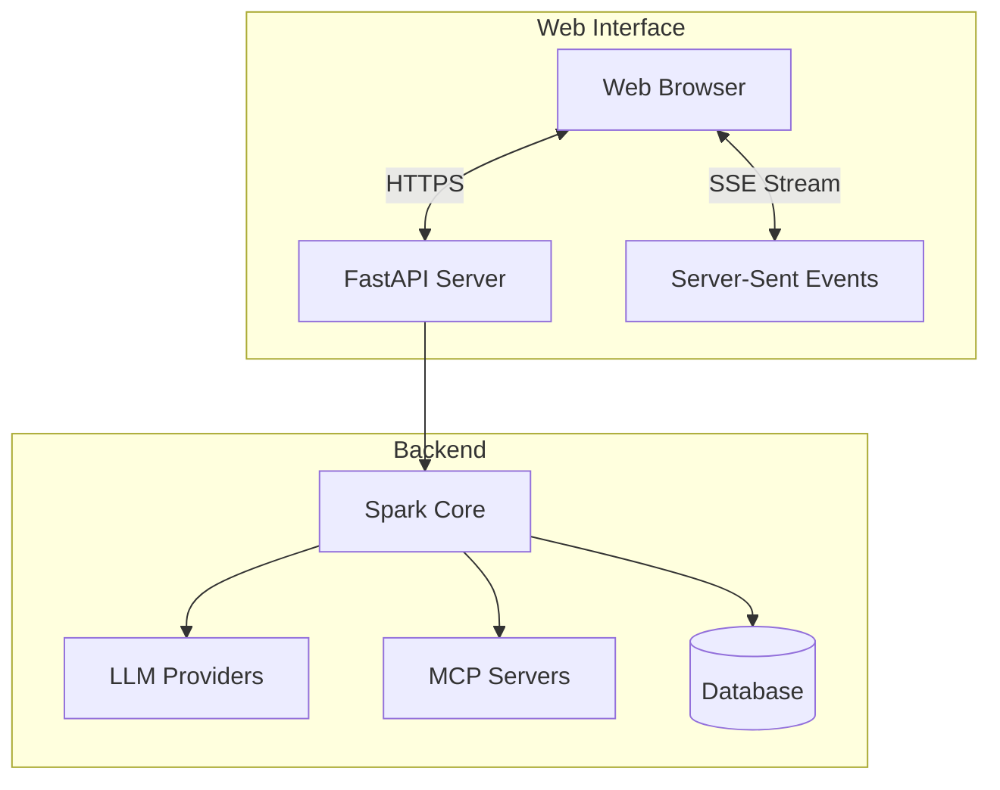
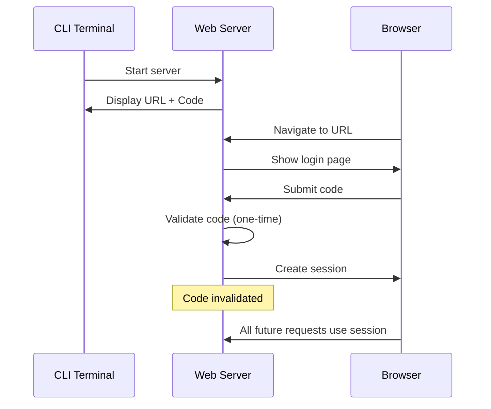
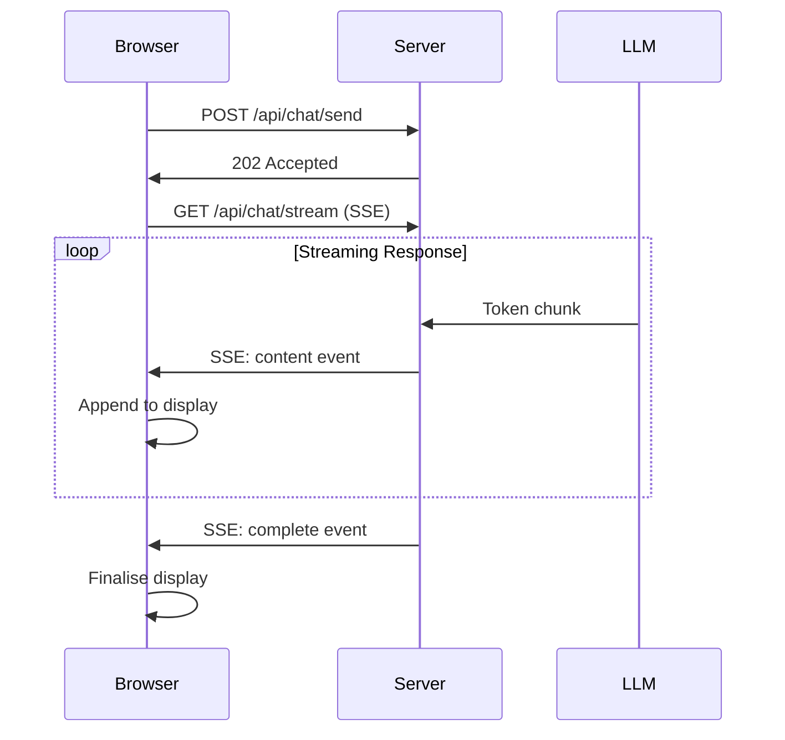

# Web Interface Guide

Spark includes a modern web browser interface as an alternative to the CLI.

## Overview



## Enabling Web Interface

### Configuration

Set `interface.type` to `web` in `config.yaml`:

```yaml
interface:
  type: web  # Change from 'cli' to 'web'

  web:
    host: 127.0.0.1              # Localhost only for security
    port: 0                      # 0 = random available port
    session_timeout_minutes: 30  # Session expiry time
    dark_theme: true             # Use dark theme
    auto_open_browser: true      # Open browser automatically

    ssl:
      enabled: true              # Enable HTTPS
      auto_generate_cert: true   # Auto-generate self-signed certificate
      cert_file: certs/ssl_cert.pem
      key_file: certs/ssl_key.pem
```

### Starting Web Mode

```bash
spark
```

When configured for web mode, you'll see:

```
╭─────────────────────────────────────────╮
│           SPARK Web Server              │
├─────────────────────────────────────────┤
│  URL: https://127.0.0.1:54321           │
│  Code: ABC12345                         │
│                                         │
│  Press Ctrl+C to stop the server        │
╰─────────────────────────────────────────╯
```

---

## Authentication

### One-Time Authentication Code



### Security Features

| Feature | Description |
|---------|-------------|
| **Localhost Only** | Server binds to 127.0.0.1 by default |
| **One-Time Code** | Authentication code valid for single use |
| **Session Timeout** | Configurable session expiry (default 30 min) |
| **HTTPS** | SSL/TLS encryption enabled by default |
| **Single Session** | Only one active session at a time |

### Login Process

1. Navigate to the URL shown in terminal
2. Enter the 8-character authentication code
3. Code is invalidated after successful login
4. Session created with configured timeout

---

## User Interface

### Main Menu

The main menu provides the same options as CLI:

```
┌─────────────────────────────────────────┐
│              SPARK                      │
├─────────────────────────────────────────┤
│                                         │
│  [Re-gather AWS Costs]                  │
│                                         │
│  [New Conversation]                     │
│                                         │
│  [List Conversations]                   │
│                                         │
│  [Logout]                               │
│                                         │
└─────────────────────────────────────────┘
```

### Information Panels

AWS account information, costs, and MCP server status displayed in collapsible panels:

- **AWS Account** - ARN, Account ID, Region
- **Bedrock Costs** - Last month and 24-hour usage
- **MCP Servers** - Connection status and tools

### Conversation List

Browse and select existing conversations:

| Column | Description |
|--------|-------------|
| Name | Conversation name |
| Model | LLM model used |
| Messages | Message count |
| Created | Creation timestamp |
| Last Activity | Most recent message |

---

## Chat Interface

### Layout

```
┌─────────────────────────────────────────┐
│  Conversation: Project Analysis    [i]  │
├─────────────────────────────────────────┤
│                                         │
│  ┌─────────────────────────────────┐    │
│  │ 👤 User                         │    │
│  │ What files are in src/?         │    │
│  └─────────────────────────────────┘    │
│                                         │
│  ┌─────────────────────────────────┐    │
│  │ 🤖 Assistant                    │    │
│  │ I'll check the directory...     │    │
│  │                                 │    │
│  │ 🛠️ Tool: list_files_recursive   │    │
│  │ └─ Result: [12 files found]     │    │
│  └─────────────────────────────────┘    │
│                                         │
├─────────────────────────────────────────┤
│  [Type your message...]        [Send]   │
└─────────────────────────────────────────┘
```

### Message Types

| Type | Style | Icon |
|------|-------|------|
| User | Purple gradient, right-aligned | 👤 |
| Assistant | Grey background, left-aligned | 🤖 |
| Tool Call | Blue background | 🛠️ |
| Tool Result | Amber background | 🔧 |
| Rollup Summary | Green background, centered | 📋 |

### Real-Time Streaming

Responses stream in real-time using Server-Sent Events (SSE):



### Markdown Rendering

Assistant responses render with full Markdown support:
- Code blocks with syntax highlighting
- Tables
- Lists (ordered and unordered)
- Headings
- Bold, italic, inline code
- Links

---

## Chat Commands

Access commands via the command menu or by typing:

### Command Menu

Click the **⋮** menu icon to access:

| Command | Description |
|---------|-------------|
| View History | Display conversation history |
| Conversation Info | Show details and token usage |
| Attach File | Add files to conversation |
| Change Model | Switch LLM model |
| Export | Download conversation |
| MCP Audit | View tool execution logs |
| MCP Servers | Toggle server states |
| Delete | Remove conversation |

### Keyboard Shortcuts

| Shortcut | Action |
|----------|--------|
| `Enter` | Send message |
| `Shift+Enter` | New line in message |
| `Escape` | Cancel current operation |

---

## Tool Permission Dialog

When the AI requests to use a tool for the first time:

```
┌─────────────────────────────────────────┐
│  🔐 Tool Permission Request             │
├─────────────────────────────────────────┤
│                                         │
│  The assistant wants to use:            │
│  write_file                             │
│                                         │
│  [Allow Once]  [Allow Always]           │
│  [Deny]        [Cancel]                 │
│                                         │
└─────────────────────────────────────────┘
```

Options:
- **Allow Once** - Permit this time only
- **Allow Always** - Permit now and in future
- **Deny** - Block now and in future
- **Cancel** - Skip this time

---

## File Attachments

### Attaching Files

1. Click **Attach File** in command menu
2. Select file from your computer
3. File uploads and attaches to conversation

### Supported Types

| Category | Extensions |
|----------|------------|
| Text | `.txt`, `.md`, `.log` |
| Code | `.py`, `.js`, `.ts`, `.java`, `.cpp`, `.c`, `.h` |
| Data | `.json`, `.yaml`, `.yml`, `.xml`, `.csv` |

### Size Limits

- Individual file: 10MB maximum
- Total attachments per conversation: 50MB

---

## Export Options

### Export Dialog

```
┌─────────────────────────────────────────┐
│  Export Conversation                    │
├─────────────────────────────────────────┤
│                                         │
│  Format:                                │
│  ○ Markdown (.md)                       │
│  ● HTML (.html)                         │
│  ○ CSV (.csv)                           │
│                                         │
│  ☑ Include tool call details            │
│                                         │
│  Filename: [conversation_export.html]   │
│                                         │
│  [Cancel]              [Download]       │
│                                         │
└─────────────────────────────────────────┘
```

### Format Features

| Format | Best For |
|--------|----------|
| **Markdown** | Documentation, further editing |
| **HTML** | Viewing, sharing, archiving |
| **CSV** | Analysis, spreadsheets |

---

## Session Management

### Session Timeout

Sessions expire after configured period (default 30 minutes):

```
┌─────────────────────────────────────────┐
│  Session Expired                        │
├─────────────────────────────────────────┤
│                                         │
│  Your session has expired.              │
│  Please re-authenticate.                │
│                                         │
│  [Return to Login]                      │
│                                         │
└─────────────────────────────────────────┘
```

### Logout

Click **Logout** to:
- Invalidate current session
- Return to login page
- Keep CLI terminal running

---

## SSL/TLS Configuration

### Auto-Generated Certificates

By default, Spark generates self-signed certificates:

```yaml
ssl:
  enabled: true
  auto_generate_cert: true
```

Browser will show security warning for self-signed certs.

### Custom Certificates

Use your own certificates:

```yaml
ssl:
  enabled: true
  auto_generate_cert: false
  cert_file: /path/to/your/cert.pem
  key_file: /path/to/your/key.pem
```

### Disabling SSL

For development only (not recommended):

```yaml
ssl:
  enabled: false
```

---

## Troubleshooting

### Cannot Connect

1. Check URL in terminal output
2. Ensure browser on same machine
3. Verify firewall allows localhost connections

### Authentication Fails

1. Code is one-time use only
2. Restart Spark to get new code
3. Check for typos in code entry

### Streaming Not Working

1. Check browser supports Server-Sent Events
2. Disable browser extensions that block connections
3. Check console for JavaScript errors

### SSL Certificate Warnings

For self-signed certificates:
- Chrome: Click "Advanced" → "Proceed to localhost"
- Firefox: Click "Advanced" → "Accept the Risk"
- Safari: Click "Show Details" → "visit this website"

---

## Browser Compatibility

| Browser | Support |
|---------|---------|
| Chrome | ✓ Full support |
| Firefox | ✓ Full support |
| Safari | ✓ Full support |
| Edge | ✓ Full support |
| IE11 | ✗ Not supported |

Requires:
- JavaScript enabled
- Server-Sent Events support
- Modern CSS (Flexbox, Grid)

---

## Next Steps

- [CLI Reference](cli-reference.md) - Command-line alternative
- [Features Guide](features.md) - All features
- [Security](security.md) - Security best practices
